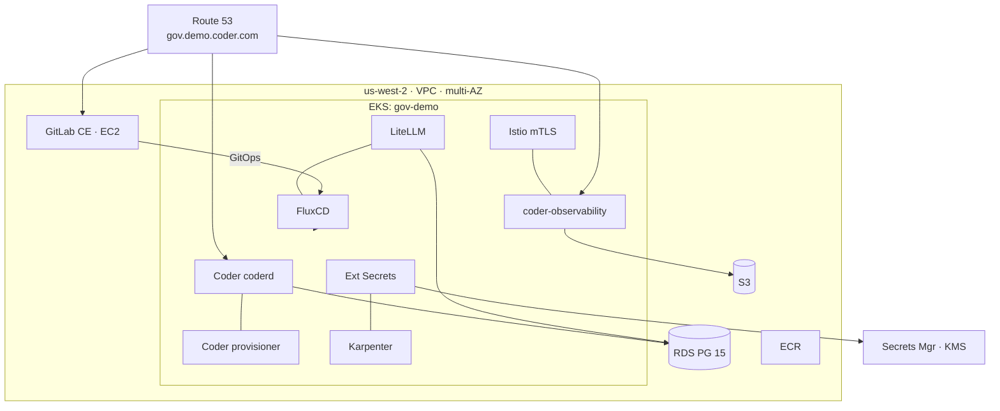
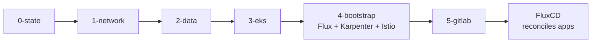

# gov.demo.coder.com

GovCloud-flavored demo environment for [Coder](https://coder.com). Single-region
(us-west-2), multi-AZ, FIPS-enabled, GitOps-controlled via FluxCD.

**Status:** Requirements complete. Terraform implementation next.

## What This Deploys

| Component | Where | Purpose |
|---|---|---|
| Coder (Premium + AI) | EKS | Developer workspaces, AI Bridge, Coder Agents |
| LiteLLM | EKS | AI gateway → Bedrock (Claude), OpenAI, Gemini |
| Karpenter | EKS | Workspace node autoscaling (spot + on-demand) |
| FluxCD (OSS) | EKS | GitOps reconciliation from GitLab CE |
| Istio (sidecar) | EKS | mTLS on all Coder east-west traffic |
| coder-observability | EKS | Prometheus + Grafana + Loki |
| External Secrets Operator | EKS | AWS Secrets Manager → K8s Secrets |
| GitLab CE + Docker Runner | EC2 (m7a.2xlarge) | Git source-of-truth, OIDC IdP, CI/CD |

## Key Design Decisions

- **FIPS everywhere** — EKS nodes use Bottlerocket FIPS AMIs; Coder binary built
  with `GOFIPS140=latest` (Go 1.24+ native FIPS 140-3); workspace images use
  RHEL 9 UBI with `crypto-policies FIPS`; all AWS APIs use FIPS endpoints
- **FluxCD over ArgoCD** — pull-based, no UI attack surface, Git-native RBAC
- **Istio mTLS** — STRICT PeerAuthentication on Coder/LiteLLM namespaces
- **GitLab CE as IdP** — built-in OIDC replaces Keycloak
- **AWS managed services** — Secrets Manager (not Vault), ECR (not Harbor),
  NAT Gateway (not fck-nat), RDS multi-AZ
- **GovCloud-portable** — all config parameterized; flip `aws_region` to
  `us-gov-west-1` in tfvars, no code changes

## Architecture



## Repo Structure

```text
├── docs/
│   ├── REQUIREMENTS.md        # Full requirements (shall statements, traceability)
│   ├── BEDROCK_SETUP.md       # Enable Claude models in Bedrock console
│   ├── CODER_FIPS_BUILD.md    # Build Coder binary/image with FIPS 140-3
│   └── dns-delegation.sh      # gcloud script: delegate gov.demo.coder.com → R53
├── images/
│   ├── base-fips/Dockerfile   # RHEL 9 UBI + FIPS crypto + Docker CE
│   ├── desktop-fips/Dockerfile# base-fips + XFCE + KasmVNC
│   └── build.gitlab-ci.yml    # GitLab CI → ECR pipeline
├── templates/
│   ├── dev-codex/main.tf      # Generic dev workspace + Codex CLI
│   └── agents-dev/main.tf     # Coder Agents (server-side AI) workspace
├── clusters/
│   └── gov-demo/              # FluxCD kustomizations
│       ├── flux-system/
│       ├── infrastructure/    # Istio, Karpenter, ESO, sources
│       └── apps/              # Coder, LiteLLM, monitoring, provisioners
└── infra/
    └── terraform/
        ├── 0-state/           # S3 backend + DynamoDB lock
        ├── 1-network/         # VPC, subnets, NAT GW, Route 53
        ├── 2-data/            # RDS, S3, KMS, Secrets Manager, ECR
        ├── 3-eks/             # EKS cluster, node groups, IRSA
        ├── 4-bootstrap/       # FluxCD + Karpenter + Istio
        └── 5-gitlab/          # GitLab CE EC2 + Docker Runner
```

## DNS

Base domain: `gov.demo.coder.com` (delegated from Google Cloud DNS → Route 53)

| Subdomain | Service |
|---|---|
| `dev.gov.demo.coder.com` | Coder |
| `*.dev.gov.demo.coder.com` | Coder workspaces |
| `gitlab.gov.demo.coder.com` | GitLab CE |
| `grafana.dev.gov.demo.coder.com` | Grafana |

## AI Models (via LiteLLM)

| Provider | Models |
|---|---|
| AWS Bedrock | Claude Sonnet 4.6, Opus 4.6, Haiku 4.5 |
| OpenAI | GPT-4o, o4-mini |
| Google | Gemini 2.5 Pro |

## Prerequisites

Before starting Terraform:

1. **DNS delegation** — run `docs/dns-delegation.sh` after `1-network` apply
2. **Bedrock models** — follow `docs/BEDROCK_SETUP.md` to enable Anthropic models
3. **API keys** — store OpenAI + Gemini keys in AWS Secrets Manager
4. **Coder FIPS build** — follow `docs/CODER_FIPS_BUILD.md` to build + push to ECR
5. **FIPS images** — push `base-fips` and `desktop-fips` to ECR via `images/build.gitlab-ci.yml`

## Deploy Sequence



## Requirements

See [docs/REQUIREMENTS.md](docs/REQUIREMENTS.md) for the full specification
(~100 shall/should statements across 14 categories with traceability matrix).
