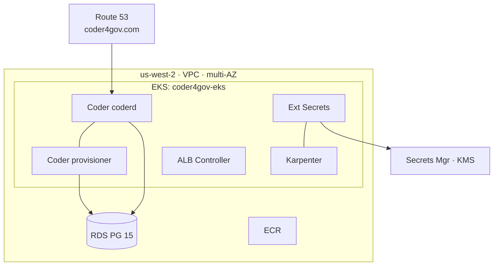
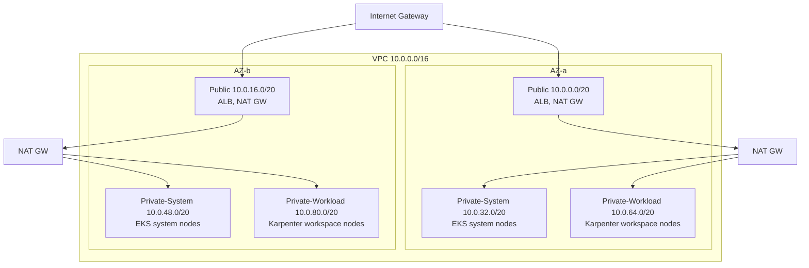
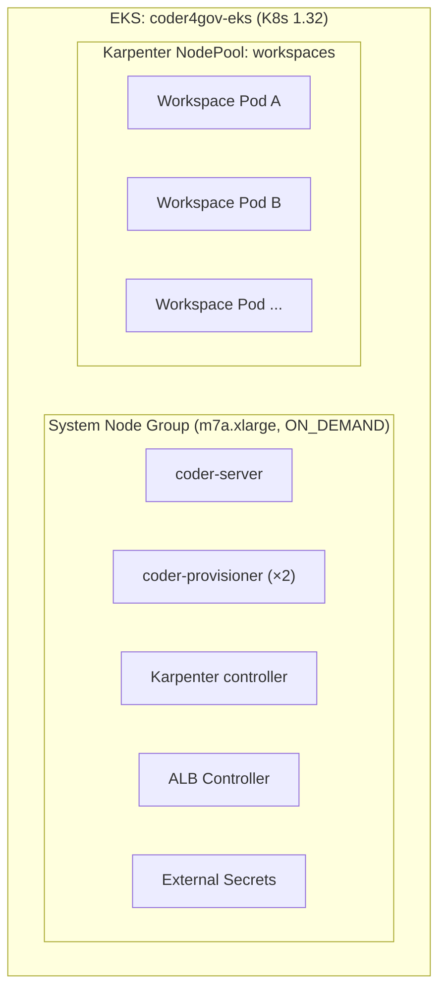
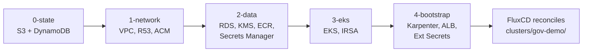
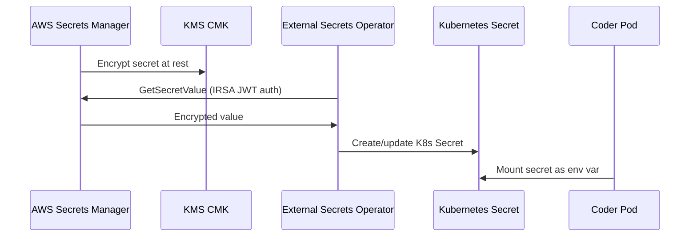

# Architecture — usgov-deploy-aws Reference Architecture

Coder on AWS (GovCloud-portable), FIPS-compliant, multi-AZ.

## Architecture at a Glance

```text
┌─────────────────────────────────────────────────────────────────────────┐
│                      TERRAFORM LAYER CHAIN                             │
│                                                                        │
│  ┌──────────┐   ┌──────────────┐   ┌─────────────┐   ┌────────────┐  │
│  │ 0-state  │──▶│  1-network   │──▶│   2-data    │──▶│   3-eks    │  │
│  │          │   │              │   │             │   │            │  │
│  │ S3 bucket│   │ VPC (multi-AZ│   │ RDS PG 15  │   │ EKS 1.32  │  │
│  │ DynamoDB │   │ 6 subnets   │   │ KMS CMK    │   │ IRSA roles │  │
│  │ (TF lock)│   │ NAT Gateways│   │ ECR repos  │   │ OIDC provdr│  │
│  └──────────┘   │ Route 53    │   │ Secrets Mgr│   └─────┬──────┘  │
│                  │ ACM cert    │   └─────────────┘         │         │
│                  └──────────────┘                           ▼         │
│                                                    ┌──────────────┐  │
│                                                    │ 4-bootstrap  │  │
│                                                    │              │  │
│                                                    │ Karpenter    │  │
│                                                    │ ALB Ctrlr    │  │
│                                                    │ Ext Secrets  │  │
│                                                    │ FluxCD       │  │
│                                                    └──────┬───────┘  │
└───────────────────────────────────────────────────────────┼──────────┘
                                                            │
                         FluxCD reconciles                  │
                         clusters/gov-demo/                 ▼
┌─────────────────────────────────────────────────────────────────────────┐
│                     EKS CLUSTER (coder4gov-eks)                        │
│                                                                        │
│  ┌─────────── System Nodes (m7a.xlarge, ON_DEMAND) ──────────────┐    │
│  │                                                                │    │
│  │  ┌──────────────┐  ┌───────────────────┐  ┌────────────────┐  │    │
│  │  │ coder-server │  │ coder-provisioner │  │   Karpenter    │  │    │
│  │  │   (coderd)   │  │      (×2)         │  │  controller    │  │    │
│  │  └──────┬───────┘  └────────┬──────────┘  └────────────────┘  │    │
│  │         │                   │                                  │    │
│  │  ┌──────────────┐  ┌───────────────────┐                      │    │
│  │  │ ALB Ctrlr    │  │ External Secrets  │                      │    │
│  │  └──────────────┘  └───────────────────┘                      │    │
│  └────────────────────────────────────────────────────────────────┘    │
│                                                                        │
│  ┌─────────── Karpenter NodePool: workspaces (spot+OD) ──────────┐    │
│  │  ┌─────────────┐  ┌─────────────┐  ┌─────────────┐           │    │
│  │  │ Workspace A │  │ Workspace B │  │ Workspace …  │           │    │
│  │  └─────────────┘  └─────────────┘  └─────────────┘           │    │
│  └────────────────────────────────────────────────────────────────┘    │
└──────────────────────────────┬──────────────────────────────────────────┘
                               │
               ┌───────────────┼───────────────┐
               ▼               ▼               ▼
         ┌──────────┐   ┌──────────┐   ┌──────────────┐
         │ RDS PG15 │   │ Secrets  │   │ Route 53     │
         │ (multi-AZ│   │ Manager  │   │ coder4gov.com│
         │  + FIPS) │   │ + KMS    │   │ + ACM cert   │
         └──────────┘   └──────────┘   └──────────────┘

┌─────────────────────────────────────────────────────────────────────────┐
│  usgov-env-demo (separate repo) layers on top via terraform_remote_state│
│                                                                        │
│  Adds: GitLab CE · Keycloak · LiteLLM · Observability (Grafana/Loki)  │
│        Istio (mTLS) · WAF · OpenSearch (SIEM) · SES                   │
│                                                                        │
│  See: github.com/coder/usgov-env-demo                                 │
└─────────────────────────────────────────────────────────────────────────┘
```

## System Overview



## Network Topology



### Subnets

| Subnet | CIDR | AZ | Purpose |
|---|---|---|---|
| Public A | 10.0.0.0/20 | a | ALB, NAT Gateway |
| Public B | 10.0.16.0/20 | b | ALB, NAT Gateway |
| Private-System A | 10.0.32.0/20 | a | EKS system node group |
| Private-System B | 10.0.48.0/20 | b | EKS system node group |
| Private-Workload A | 10.0.64.0/20 | a | Karpenter workspace nodes |
| Private-Workload B | 10.0.80.0/20 | b | Karpenter workspace nodes |

## EKS Cluster Architecture



### Node Pools

| Pool | Type | Instance Types | Scaling |
|---|---|---|---|
| System | Managed Node Group | m7a.xlarge | min=2, max=4, on-demand |
| Workspaces | Karpenter NodePool | m7a/m7i .xlarge–.4xlarge | spot + on-demand, consolidation after 5m |

## Terraform Layer Dependency Graph



### Layer Outputs → Consumers

| Output | Source | Consumer |
|---|---|---|
| `vpc_id`, `subnet_ids` | L1 | L2, L3, L4 |
| `route53_zone_id`, `acm_wildcard_cert_arn` | L1 | L4, Flux manifests |
| `kms_key_arn`, `rds_endpoint`, `ecr_repo_urls` | L2 | L3, L4, Flux manifests |
| `cluster_name`, `oidc_provider_arn` | L3 | L4 |
| `karpenter_node_role_name` | L4 | EC2NodeClass |

## Secret Management Flow



### Secrets

| Secret | Path | Created By | Consumed By |
|---|---|---|---|
| RDS master password | `coder4gov/rds-master-password` | Terraform (auto) | ExternalSecret → coder-db-credentials |
| Coder license | `coder4gov/coder-license` | seed-secrets.sh | ExternalSecret → coder-license |

## FIPS Compliance

| Layer | Mechanism |
|---|---|
| AWS API calls | FIPS endpoints (`use_fips_endpoint = true`) |
| Data at rest | KMS CMK (RDS, EBS, ECR, Secrets Manager, S3 state) |
| Data in transit | TLS 1.2+ (ALB `ELBSecurityPolicy-TLS13-1-2-2021-06`, RDS `rds.force_ssl`) |
| Coder binary | `GOFIPS140=latest` (Go 1.24+ native FIPS 140-3 module) |
| Workspace images | RHEL 9 UBI + `crypto-policies FIPS` |
| EKS nodes | AL2023 with FIPS crypto policy |

## Disaster Recovery

| Component | Backup | RTO | RPO |
|---|---|---|---|
| Terraform state | S3 versioning + DynamoDB PITR | < 1h | 0 (versioned) |
| RDS | Automated snapshots (7d retention) | < 1h | < 5 min |
| Coder config | Git (this repo) | < 30 min | Last commit |

## Integration Point — usgov-env-demo

This repo's Terraform state is consumed by `coder/usgov-env-demo` via
`terraform_remote_state`. That repo layers additional platform services
on top of the infrastructure defined here. No changes to this repo are
required to support those additions.
