# coder4gov.com — Architecture Diagrams

> **Audience:** New engineers, architects, and security reviewers evaluating the system.
>
> Every diagram below uses [Mermaid](https://mermaid.js.org/) syntax and renders natively on GitHub. Open this file in any Markdown viewer that supports Mermaid (GitHub, VS Code with the Mermaid extension, etc.).

---

## Table of Contents

1. [How to Read These Diagrams](#how-to-read-these-diagrams)
2. [Executive Overview (C4 Context)](#1-executive-overview--c4-context-level)
3. [System Container Diagram (C4 Container)](#2-system-container-diagram--c4-container-level)
4. [Network Topology](#3-network-topology)
5. [Security Groups & Port-Level Access](#3a-security-groups--port-level-access)
6. [Ingress & Egress Traffic Flows](#3b-ingress--egress-traffic-flows)
7. [EKS Cluster Architecture](#4-eks-cluster-architecture)
8. [Authentication & SSO Flow](#5-authentication--sso-flow)
9. [AI Model Routing](#6-ai-model-routing)
10. [GitOps Reconciliation Flow](#7-gitops-reconciliation-flow)
11. [Secret Management Flow](#8-secret-management-flow)
12. [Terraform Layer Dependency Graph](#9-terraform-layer-dependency-graph)
13. [FIPS Compliance Architecture](#10-fips-compliance-architecture)
14. [Disaster Recovery & Backup Architecture](#11-disaster-recovery--backup-architecture)
15. [WAF & Security Boundary](#12-waf--security-boundary)

---

## How to Read These Diagrams

This document follows an adapted **C4 model** (Context, Containers, Components, Code) to present the architecture at multiple abstraction levels:

| Level | What It Shows | Audience |
|-------|---------------|----------|
| **Context (L1)** | The system as a single box plus external actors and dependencies | Executives, new joiners |
| **Container (L2)** | Major deployable units (services, databases, buckets) and their protocols | Architects, tech leads |
| **Component (L3)** | Internal structure of a single container — classes, modules, controllers | Developers |
| **Code (L4)** | Source-level detail — typically not diagrammed, just read the code | Developers |

Diagrams 1–2 are Context/Container level. Diagrams 3–12 zoom into specific cross-cutting concerns (network, security, GitOps, etc.) at Component level.

**Color legend used throughout:**

| Color/Style | Meaning |
|-------------|---------|
| Blue nodes | Internal services we operate |
| Green nodes | AWS managed services |
| Orange nodes | External third-party APIs |
| Dashed lines | Asynchronous / eventual-consistency flows |
| Solid lines | Synchronous request/response |

---

## 1. Executive Overview — C4 Context Level

The highest-level view. coder4gov.com is a secure cloud development platform for government developers. It connects to identity providers, AI model APIs, and AWS infrastructure.

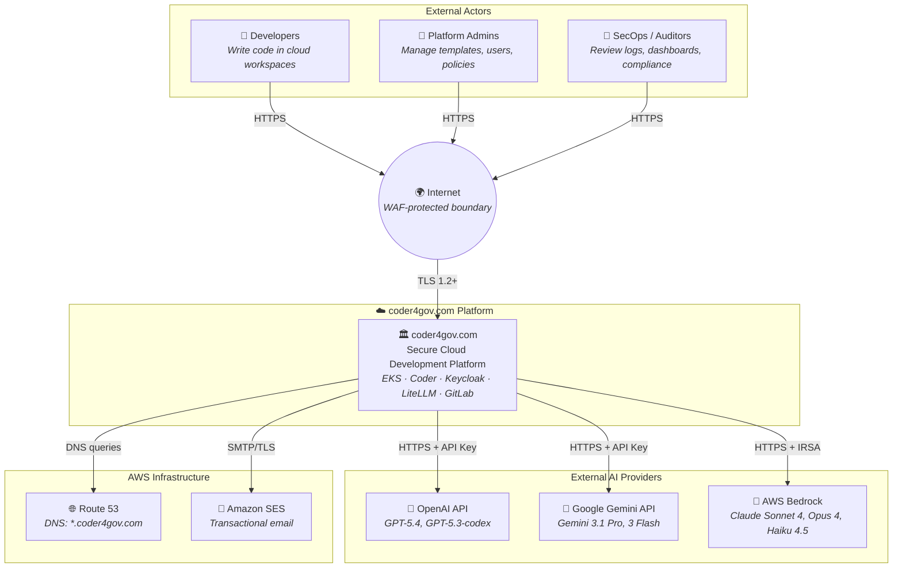

---

## 2. System Container Diagram — C4 Container Level

All deployable containers/services and how they communicate. This is the "what runs where" view that architects need to understand integration points and data flows.

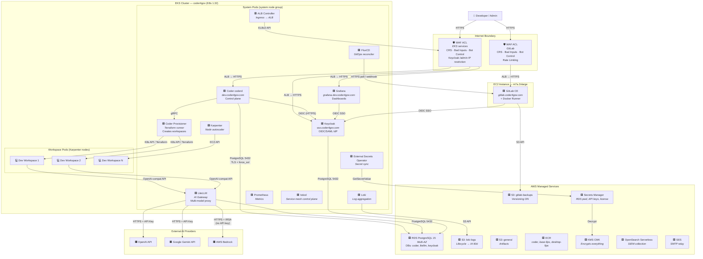

---

## 3. Network Topology

The VPC uses a `10.0.0.0/16` CIDR divided into six `/20` subnets across two Availability Zones. Each `/20` provides 4,094 usable host IPs. The subnet allocation is computed dynamically via `cidrsubnet(var.vpc_cidr, 4, offset)`, producing the layout below. Public subnets host ALBs and NAT Gateways; private-system subnets host EKS system nodes; private-workload subnets host Karpenter-managed workspace nodes.

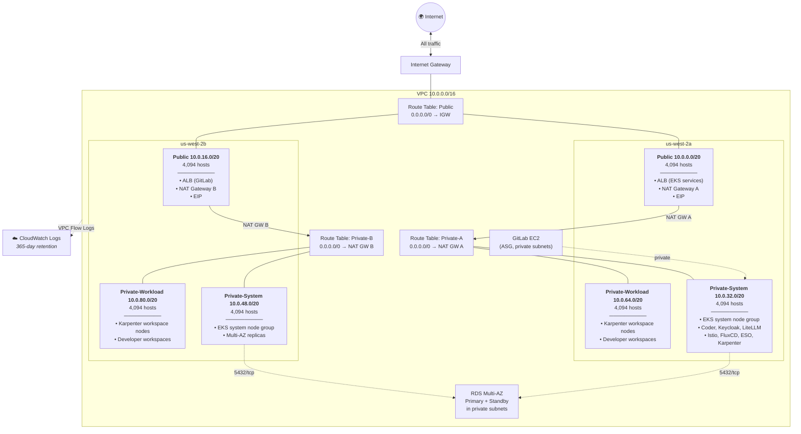

**Traffic Flow Summary:**

| Path | Route |
|------|-------|
| Internet → EKS services | Internet → IGW → ALB (public subnet) → Target pods (private-system subnet) |
| Internet → GitLab | Internet → IGW → ALB (public subnet) → EC2 (private subnet) |
| Pods → Internet (e.g., AI APIs) | Pod → NAT GW (public subnet) → IGW → Internet |
| Pod → RDS | Pod (private subnet) → RDS endpoint (private subnet, same VPC) |

---

## 3a. Security Groups & Port-Level Access

Five security groups control network access across the deployment. The EKS module creates two automatically (cluster SG, node SG); the remaining three are explicit Terraform resources. All follow least-privilege: every ingress rule names its source, and no security group allows `0.0.0.0/0` inbound except the ALBs on ports 80/443.

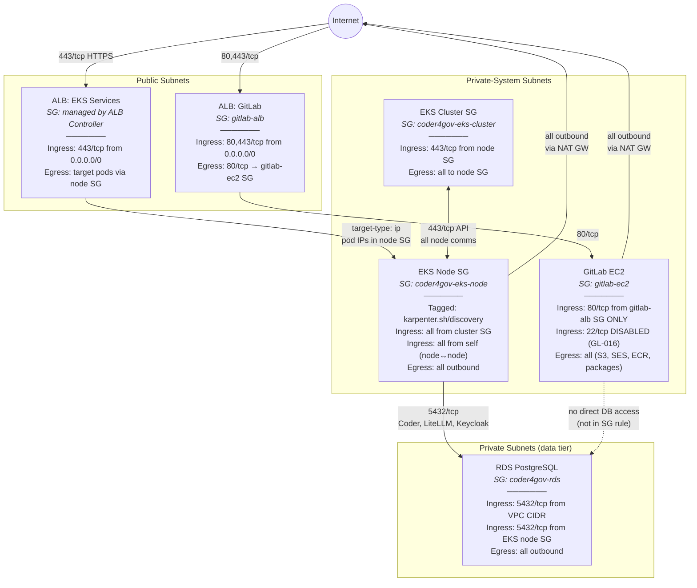

### Port Matrix

Every allowed port in the system:

| Source | Destination | Port | Protocol | Purpose | Terraform Resource |
|--------|-------------|------|----------|---------|--------------------|
| `0.0.0.0/0` | GitLab ALB SG | 443 | TCP | HTTPS from internet | `5-gitlab/security-groups.tf` |
| `0.0.0.0/0` | GitLab ALB SG | 80 | TCP | HTTP → HTTPS redirect | `5-gitlab/security-groups.tf` |
| GitLab ALB SG | GitLab EC2 SG | 80 | TCP | ALB → GitLab (TLS terminated at ALB) | `5-gitlab/security-groups.tf` |
| `0.0.0.0/0` | EKS ALB (managed) | 443 | TCP | HTTPS to Coder/Keycloak/Grafana | ALB Controller annotations |
| EKS ALB | EKS Node SG | pod ports | TCP | ALB → target pods (IP mode) | ALB Controller target-type: ip |
| EKS Node SG | EKS Cluster SG | 443 | TCP | kubelet → API server | EKS module (auto-created) |
| EKS Cluster SG | EKS Node SG | all | TCP | API server → kubelets, webhooks | EKS module (auto-created) |
| EKS Node SG | EKS Node SG | all | all | Pod-to-pod (CNI, Istio mTLS) | EKS module (auto-created) |
| EKS Node SG | RDS SG | 5432 | TCP | Coder/LiteLLM/Keycloak → Postgres | `3-eks/main.tf` |
| VPC CIDR | RDS SG | 5432 | TCP | Broad VPC access (fallback) | `2-data/rds.tf` |
| GitLab EC2 SG | `0.0.0.0/0` | all | all | Outbound (S3, SES, ECR, apt) | `5-gitlab/security-groups.tf` |
| EKS Node SG | `0.0.0.0/0` | all | all | Outbound via NAT (AI APIs, ECR, etc.) | EKS module (auto-created) |

### What Is NOT Allowed

| Blocked Path | Why | Enforcement |
|---|---|---|
| Internet → GitLab EC2 directly | No public IP, no SG ingress from `0.0.0.0/0` | SG + private subnet |
| Internet → EKS nodes directly | No public IP, private subnets only | Subnet routing |
| Internet → RDS | No public access, private subnets, SG restricted | `publicly_accessible = false` + SG |
| SSH (port 22) → GitLab EC2 | SSH disabled per GL-016 | SG rule absent (empty `allowed_ssh_cidrs`) |
| SSH → EKS nodes | No SSH key pair, no SG rule | EKS module config |
| GitLab EC2 → RDS | Not in the EKS Node SG, no SG rule for GitLab→RDS | Explicit omission |
| Pod → Pod (cross-namespace, no mesh) | Istio STRICT mTLS on coder/litellm/keycloak namespaces | PeerAuthentication |

---

## 3b. Ingress & Egress Traffic Flows

Detailed path for every traffic type entering or leaving the VPC.

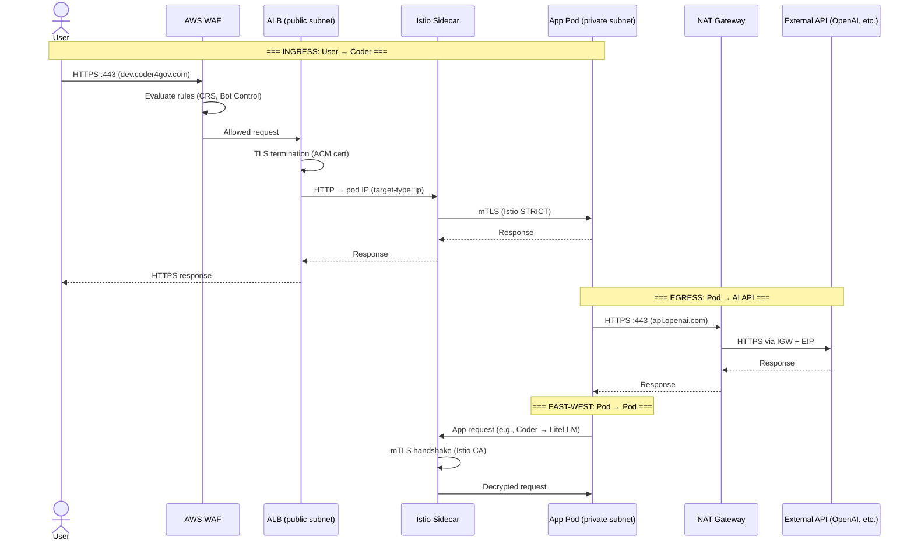

### Egress Destinations

All outbound connections from the VPC route through NAT Gateways (one per AZ) with static Elastic IPs. This is relevant for IP allowlisting on external services.

| Source | Destination | Port | Purpose |
|--------|-------------|------|---------|
| LiteLLM pods | `bedrock-runtime.us-west-2.amazonaws.com` | 443 | Bedrock API (Claude models) — FIPS endpoint |
| LiteLLM pods | `api.openai.com` | 443 | OpenAI API (GPT-5.4, Codex) |
| LiteLLM pods | `generativelanguage.googleapis.com` | 443 | Gemini API |
| ESO pods | `secretsmanager.us-west-2.amazonaws.com` | 443 | Secrets Manager — FIPS endpoint |
| EKS nodes | `api.ecr.us-west-2.amazonaws.com` | 443 | ECR image pulls — FIPS endpoint |
| EKS nodes | `eks.us-west-2.amazonaws.com` | 443 | EKS API — FIPS endpoint |
| Loki pods | `s3.us-west-2.amazonaws.com` | 443 | S3 log storage — FIPS endpoint |
| GitLab EC2 | `email-smtp.us-west-2.amazonaws.com` | 587 | SES SMTP (TLS STARTTLS) |
| GitLab EC2 | `packages.gitlab.com`, apt repos | 443 | Package updates |
| All pods | `169.254.169.254` | 80 | IMDS (instance metadata — disabled for pods via IRSA) |

---

## 4. EKS Cluster Architecture

The EKS cluster uses a two-tier node model: a managed **system node group** for platform services and a **Karpenter-managed workspace pool** for developer workspaces. The system nodes carry a `CriticalAddonsOnly` taint to prevent workspace pods from being scheduled on them. VPC-CNI prefix delegation is enabled for high pod density.

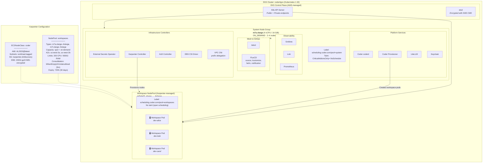

---

## 5. Authentication & SSO Flow

All user-facing services (Coder, GitLab, Grafana) delegate authentication to Keycloak at `sso.coder4gov.com` using OpenID Connect (OIDC). Keycloak is the single source of identity and supports WebAuthn/passkey as the primary authentication mechanism. The OIDC authorization code flow is shown below.

### 5.1 Coder Login (Primary Flow)

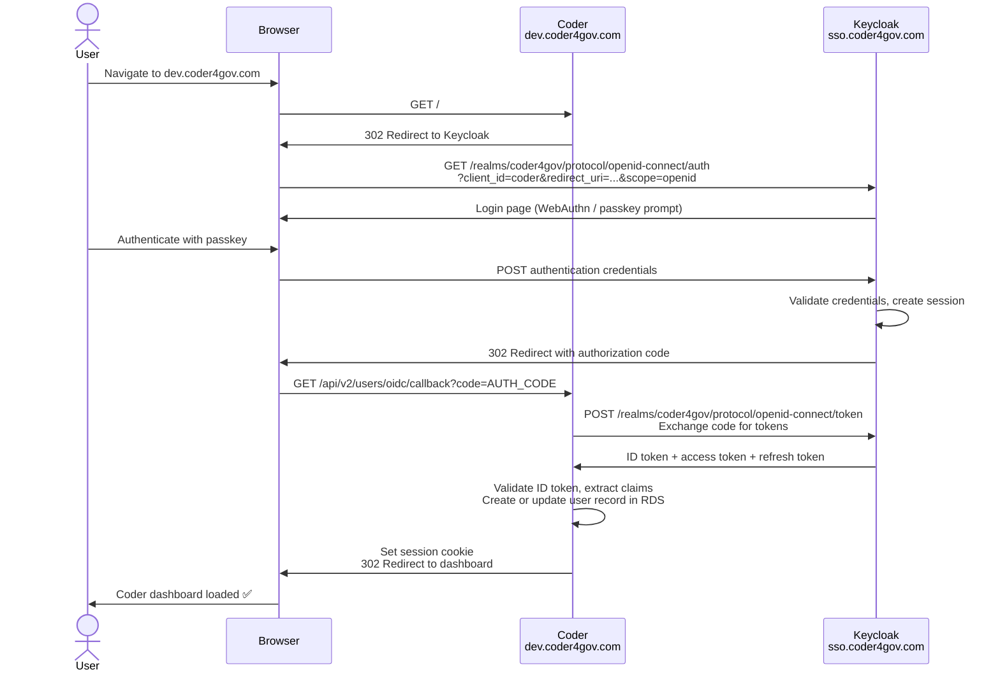

### 5.2 GitLab and Grafana SSO (Same Pattern, Different Clients)

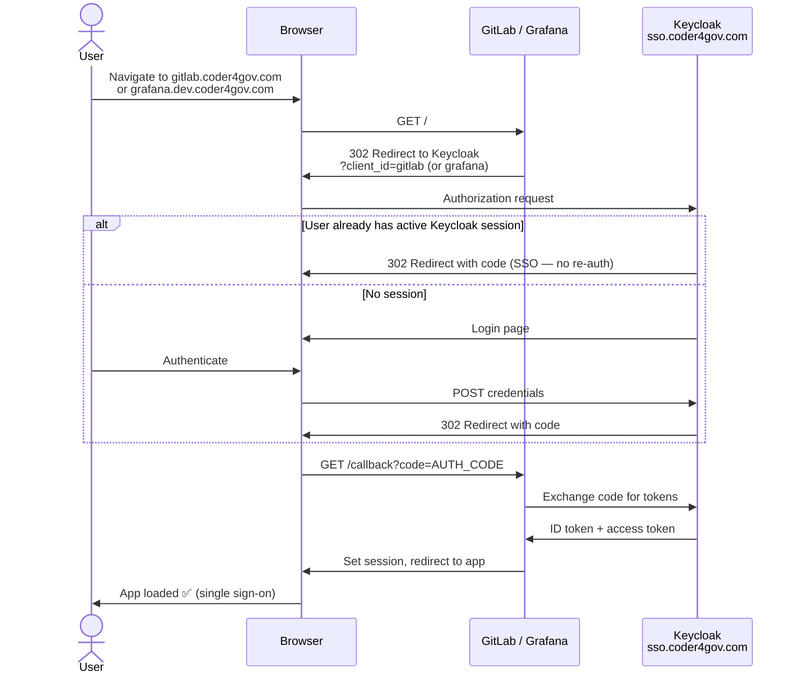

---

## 6. AI Model Routing

Developer workspaces connect to AI models through LiteLLM, a multi-provider proxy that presents a unified OpenAI-compatible API. LiteLLM routes requests to AWS Bedrock (Claude), OpenAI, or Google Gemini based on the model name. Bedrock authentication uses IRSA (IAM Roles for Service Accounts) — no static API keys. OpenAI and Gemini use API keys sourced from AWS Secrets Manager via External Secrets Operator.

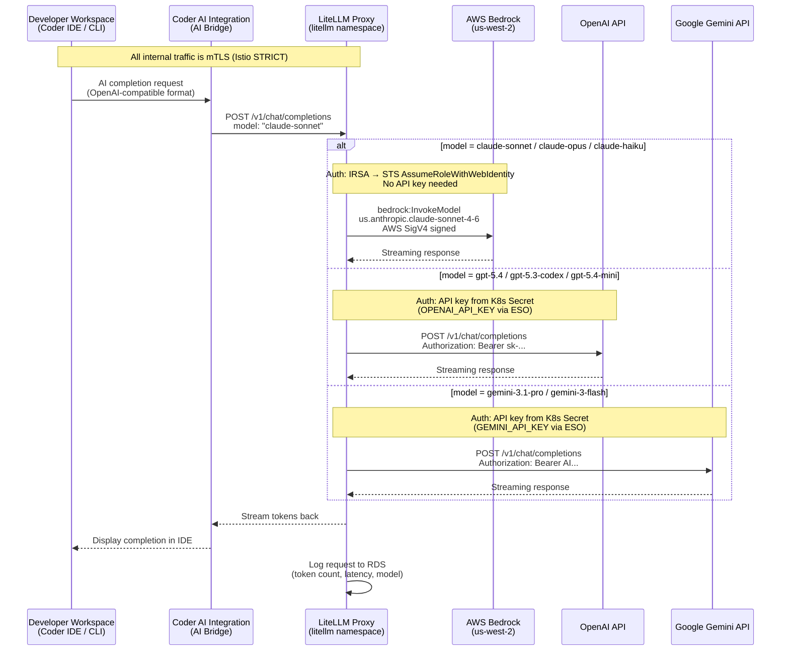

### Model Catalog

| Model Alias | Provider | Underlying Model ID | Auth Method |
|-------------|----------|---------------------|-------------|
| `claude-sonnet` | AWS Bedrock | `us.anthropic.claude-sonnet-4-6` | IRSA (SigV4) |
| `claude-opus` | AWS Bedrock | `us.anthropic.claude-opus-4-6-v1` | IRSA (SigV4) |
| `claude-haiku` | AWS Bedrock | `us.anthropic.claude-haiku-4-5-20251001-v1:0` | IRSA (SigV4) |
| `gpt-5.4` | OpenAI | `openai/gpt-5.4` | API key |
| `gpt-5.3-codex` | OpenAI | `openai/gpt-5.3-codex` | API key |
| `gpt-5.4-mini` | OpenAI | `openai/gpt-5.4-mini` | API key |
| `gemini-3.1-pro` | Google | `gemini/gemini-3.1-pro-preview` | API key |
| `gemini-3-flash` | Google | `gemini/gemini-3-flash-preview` | API key |

---

## 7. GitOps Reconciliation Flow

All Kubernetes application state is managed declaratively via FluxCD. Code changes flow from developer commits through GitLab to FluxCD, which reconciles the desired state against the cluster. FluxCD polls the Git repository every 5 minutes and reconciles Kustomizations every 10 minutes.

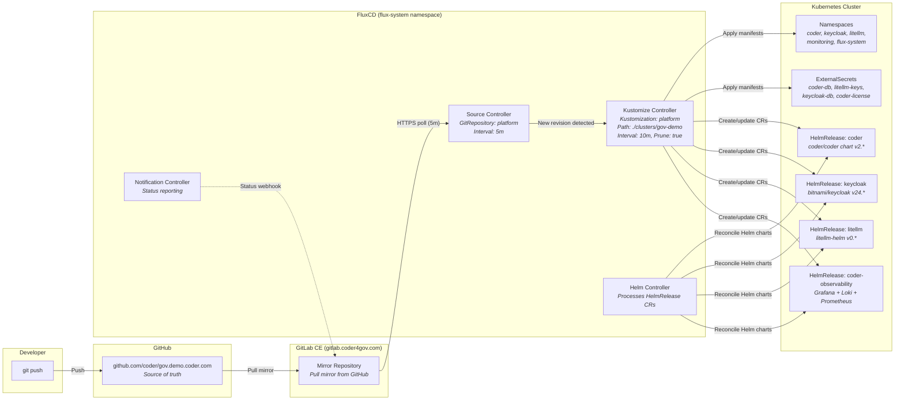

### Repository Layout

```
clusters/gov-demo/
├── infrastructure/
│   ├── kustomization.yaml      # Root kustomization
│   ├── namespaces.yaml         # Namespace definitions
│   ├── sources/                # HelmRepository sources
│   │   ├── coder.yaml
│   │   ├── coder-observability.yaml
│   │   ├── litellm.yaml
│   │   └── bitnami.yaml
│   └── secrets/                # ExternalSecret definitions
│       ├── coder-db.yaml
│       ├── coder-license.yaml
│       ├── litellm-keys.yaml
│       └── keycloak-db.yaml
└── apps/                       # HelmRelease definitions
    ├── coder-server/
    ├── coder-provisioner/
    ├── keycloak/
    ├── litellm/
    └── monitoring/
```

---

## 8. Secret Management Flow

All secrets are stored in AWS Secrets Manager, encrypted with a KMS Customer Managed Key. The External Secrets Operator (ESO) synchronizes secrets into Kubernetes using IRSA-authenticated access. Secrets refresh every hour.

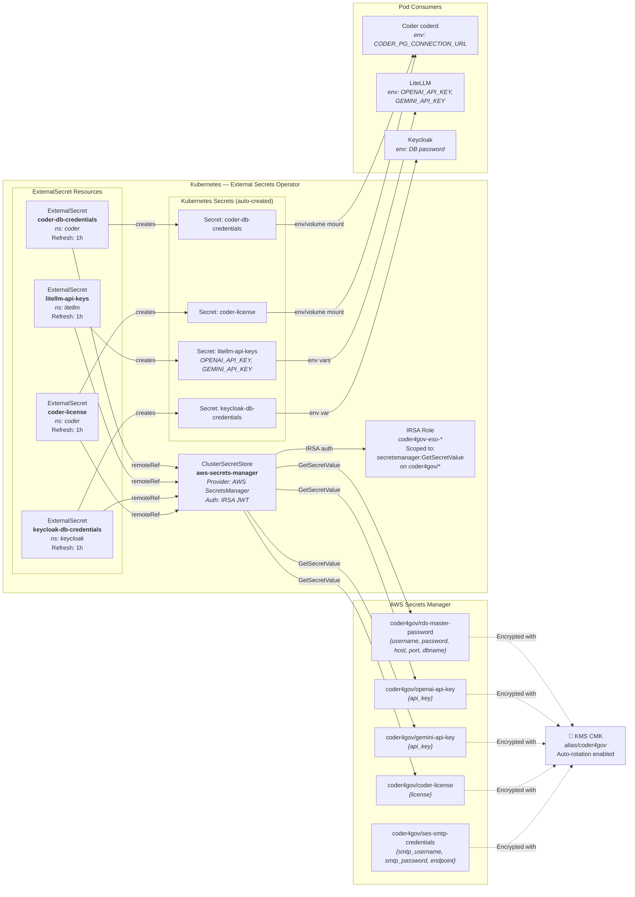

---

## 9. Terraform Layer Dependency Graph

Infrastructure is decomposed into six Terraform layers (0–5) that form a directed acyclic graph. Each layer reads outputs from previous layers via `terraform_remote_state`. This enables independent planning/applying and minimizes blast radius. Layer 4 optionally bootstraps FluxCD, which then takes over application lifecycle via GitOps.

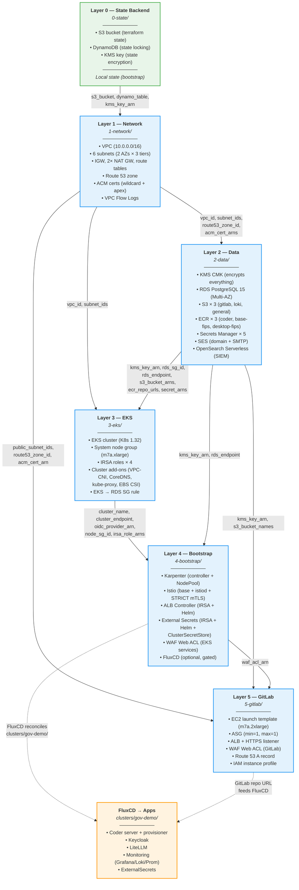

### Layer Output → Consumer Map

| Source Layer | Key Output | Consumer |
|-------------|-----------|----------|
| L0 | `s3_bucket`, `dynamodb_table`, `kms_key_arn` | All layers (backend config) |
| L1 | `vpc_id`, `vpc_cidr` | L2, L3, L5 |
| L1 | `public_subnet_ids` | L5 (ALB) |
| L1 | `private_system_subnet_ids` | L3 (EKS system nodes) |
| L1 | `private_workload_subnet_ids` | L3 (EKS), L4 (Karpenter) |
| L1 | `route53_zone_id` | L2 (SES), L5 (GitLab DNS) |
| L1 | `acm_wildcard_cert_arn` | L5 (GitLab ALB), FluxCD apps (Ingress) |
| L2 | `kms_key_arn` | L3 (EKS encryption), L4 (Karpenter EBS), L5 (GitLab EBS) |
| L2 | `rds_endpoint`, `rds_security_group_id` | L3 (SG rule), FluxCD apps (DB connection) |
| L2 | `secret_arns` | L4 (ESO policy scope) |
| L3 | `cluster_name`, `cluster_endpoint` | L4 (all Helm charts), L5 |
| L3 | `oidc_provider_arn` | L4 (IRSA roles for ESO, ALB, Karpenter) |
| L3 | `irsa_role_arns` | FluxCD apps (service account annotations) |
| L4 | `waf_web_acl_arn` | FluxCD apps (ALB Ingress annotations) |

---

## 10. FIPS Compliance Architecture

FIPS 140-2/140-3 compliance is enforced at every layer of the stack — from AWS API calls through the application runtime down to workspace container images. This diagram shows all FIPS enforcement points.

```mermaid
graph TB
    subgraph TRANSIT["Encryption in Transit"]
        T1["TLS 1.2+ enforced on all connections<br/><i>ALB: ELBSecurityPolicy-TLS13-1-2-2021-06</i>"]
        T2["Istio mTLS STRICT<br/><i>All east-west pod traffic</i><br/><i>Namespaces: coder, litellm, keycloak, istio-system</i>"]
        T3["RDS force_ssl = 1<br/><i>Rejects non-TLS PostgreSQL connections</i>"]
        T4["S3 bucket policies<br/><i>Deny aws:SecureTransport=false</i><br/><i>Deny s3:TlsVersion < 1.2</i>"]
    end

    subgraph REST["Encryption at Rest"]
        R1["KMS CMK (alias/coder4gov)<br/><i>Auto-rotation enabled</i><br/><i>Encrypts: RDS, S3, EBS, ECR,<br/>Secrets Manager, OpenSearch</i>"]
        R2["EKS Secrets encryption<br/><i>cluster_encryption_config → KMS CMK</i>"]
        R3["EBS gp3 volumes<br/><i>KMS-encrypted (system + workspace nodes)</i>"]
        R4["Terraform state bucket<br/><i>SSE-KMS with dedicated state key</i>"]
    end

    subgraph API_FIPS["AWS FIPS API Endpoints"]
        F1["use_fips_endpoint = true<br/><i>All Terraform providers</i>"]
        F2["FIPS endpoints for:<br/>• S3, KMS, STS, EC2<br/>• Secrets Manager, RDS<br/>• EKS, ECR, SES"]
    end

    subgraph APP_FIPS["Application-Level FIPS"]
        A1["Coder Binary<br/><i>Built with GOFIPS140=latest</i><br/><i>Go FIPS 140-3 cryptographic module</i><br/><i>GOEXPERIMENT=systemcrypto</i>"]
        A2["Workspace Images<br/><i>RHEL 9 UBI base</i><br/><i>crypto-policies set to FIPS</i><br/><i>update-crypto-policies --set FIPS</i>"]
        A3["GitLab EC2<br/><i>AL2023 with FIPS kernel</i><br/><i>fips-mode-setup --enable</i>"]
    end

    subgraph AUDIT["Audit & Logging"]
        AU1["VPC Flow Logs → CloudWatch<br/><i>365-day retention</i>"]
        AU2["CloudTrail → OpenSearch SIEM"]
        AU3["WAF Logs → CloudWatch<br/><i>90-day retention</i>"]
        AU4["Coder audit logging enabled<br/><i>CODER_AUDIT_LOGGING=true</i>"]
        AU5["RDS log_connections = 1<br/>RDS log_disconnections = 1<br/>RDS log_statement = ddl"]
    end

    TRANSIT --- REST
    REST --- API_FIPS
    API_FIPS --- APP_FIPS
    APP_FIPS --- AUDIT
```

### FIPS Enforcement Checklist

| Layer | Control | Configuration |
|-------|---------|---------------|
| **AWS API** | FIPS endpoints | `use_fips_endpoint = true` in all providers |
| **Network** | TLS 1.2+ only | ALB policy `ELBSecurityPolicy-TLS13-1-2-2021-06` |
| **Service mesh** | mTLS STRICT | Istio PeerAuthentication in coder, litellm, keycloak, istio-system |
| **Database** | Force SSL | RDS parameter `rds.force_ssl = 1` |
| **Storage** | KMS-CMK encryption | All S3 buckets use `aws:kms` with CMK |
| **Storage** | Deny insecure transport | S3 bucket policies block non-TLS and TLS < 1.2 |
| **Compute** | FIPS crypto | Coder built with `GOFIPS140=latest` |
| **Compute** | FIPS kernel | GitLab EC2 on AL2023 FIPS mode |
| **Workspace** | FIPS crypto-policies | RHEL 9 UBI images with FIPS mode |
| **Secrets** | KMS-CMK encryption | All Secrets Manager secrets use CMK |
| **EKS** | Envelope encryption | etcd secrets encrypted with KMS CMK |
| **Disk** | KMS-CMK encryption | All EBS volumes (system + workspace) KMS-encrypted |

---

## 11. Disaster Recovery & Backup Architecture

The platform is designed for rapid recovery. Stateful data is backed up with configurable retention. Stateless infrastructure can be fully reconstructed from Terraform state and Git repositories.

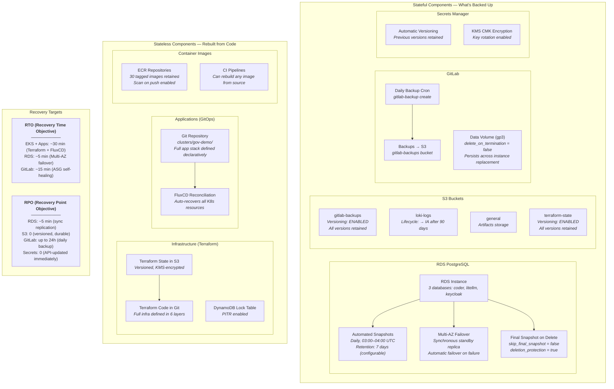

### Recovery Playbooks

| Failure Scenario | Recovery Method | Estimated Time |
|-----------------|-----------------|----------------|
| Single EKS node failure | Karpenter auto-replaces workspace nodes; ASG replaces system nodes | 2–5 min |
| AZ outage | Multi-AZ: RDS failover, EKS reschedules to surviving AZ, NAT GW per-AZ | 5–10 min |
| RDS instance failure | Automatic Multi-AZ failover to standby | ~5 min |
| GitLab instance failure | ASG launches new instance, EBS data volume persists | 10–15 min |
| Full cluster loss | `terraform apply` layers 0–4, FluxCD reconciles apps from Git | ~30 min |
| Accidental secret deletion | Restore from Secrets Manager version history | < 1 min |
| Terraform state corruption | Restore previous version from S3 versioning | < 5 min |

---

## 12. WAF & Security Boundary

All public-facing services are protected by AWS WAF Web ACLs. There are two independent WAF ACLs: one for EKS-hosted services (Coder, Keycloak, Grafana) created in Layer 4, and one for GitLab created in Layer 5. Internal pod-to-pod traffic is secured by Istio mTLS.

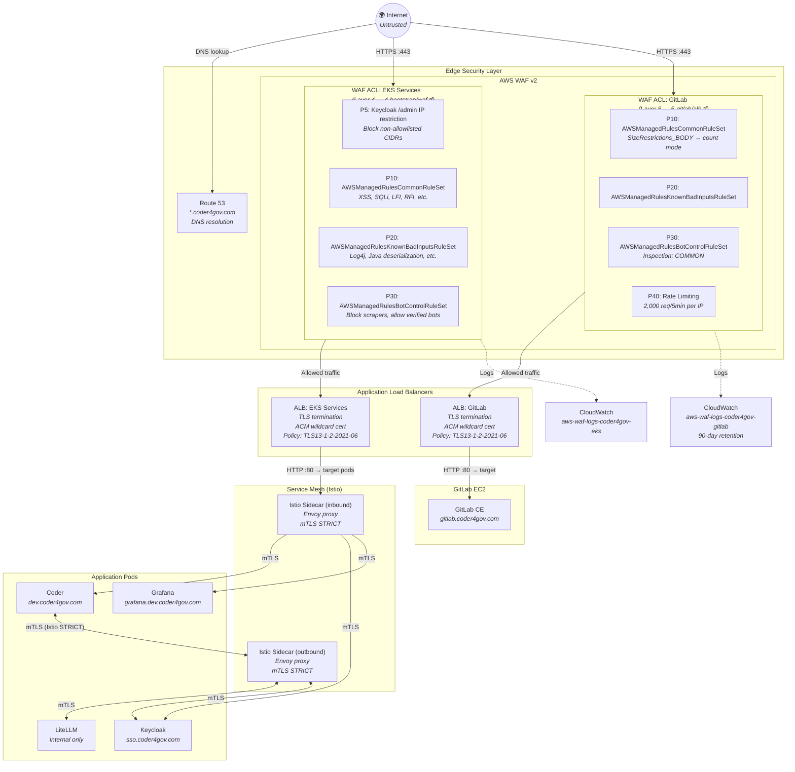

### Security Layers Summary

| Layer | Component | Protection |
|-------|-----------|------------|
| **L1 — DNS** | Route 53 | Domain registration, DNSSEC-capable |
| **L2 — WAF** | AWS WAF v2 | Common Rule Set, Bad Inputs, Bot Control, IP restriction, rate limiting |
| **L3 — TLS** | ALB | TLS 1.2+ termination with ACM certs, HSTS headers (63072000s) |
| **L4 — Mesh** | Istio mTLS STRICT | All east-west traffic encrypted, identity-verified |
| **L5 — App** | Coder, Keycloak | OIDC auth, passkey/WebAuthn, audit logging, RBAC |
| **L6 — Data** | RDS, S3, SM | KMS encryption at rest, force SSL, bucket policies |
| **L7 — Audit** | CloudWatch, OpenSearch | VPC Flow Logs, CloudTrail, WAF logs, Coder audit logs |

---

*Last updated: 2025 · Generated from source analysis of `infra/terraform/` and `clusters/gov-demo/`*
