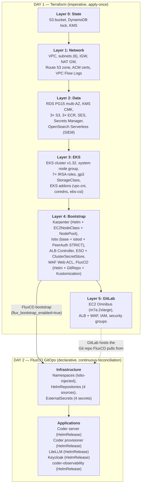

# Operations Guide — coder4gov.com

> **Audience:** A single SE maintaining this stack solo.
> **Last updated:** 2025-03-24

---

## Table of Contents

1. [Overview](#1-overview)
2. [Terraform vs GitOps Boundary](#2-terraform-vs-gitops-boundary)
3. [The Handoff Point](#3-the-handoff-point)
4. [Day 1 Operations](#4-day-1-operations)
5. [Day 2 Operations](#5-day-2-operations)
6. [Runbooks](#6-runbooks)
7. [Security Notes](#7-security-notes)

---

## 1. Overview

This repo deploys a **GovCloud-flavored Coder demo environment** at
`coder4gov.com`. It runs on **AWS commercial** (`us-west-2`) today but is
fully parameterized for a lift-and-shift to **AWS GovCloud**
(`us-gov-west-1`) — flip a few tfvars, no code changes.

The platform is split into two operational phases:

| Phase | Tool | Philosophy |
|---|---|---|
| **Day 1** | Terraform (layers 0–5) | Imperative, apply-once infrastructure provisioning |
| **Day 2** | FluxCD GitOps | Declarative, continuous reconciliation of application workloads |

**What runs here:**

| Component | Runtime | Purpose |
|---|---|---|
| Coder (Premium + AI) | EKS | Developer workspaces, AI Bridge |
| LiteLLM | EKS | AI gateway → Bedrock (Claude), OpenAI, Gemini |
| Keycloak | EKS | Central SSO (OIDC) for Coder, GitLab, Grafana |
| coder-observability | EKS | Prometheus + Grafana + Loki |
| FluxCD (OSS) | EKS | GitOps reconciliation from GitLab CE |
| Istio (sidecar mesh) | EKS | mTLS on all east-west traffic |
| Karpenter | EKS | Workspace node autoscaling (spot + on-demand) |
| External Secrets Operator | EKS | AWS Secrets Manager → K8s Secrets |
| GitLab CE + Docker Runner | EC2 (m7a.2xlarge) | Git source-of-truth, CI/CD, OIDC IdP |

**DNS layout:**

| Subdomain | Service |
|---|---|
| `dev.coder4gov.com` | Coder |
| `*.dev.coder4gov.com` | Coder workspace apps (subdomain routing) |
| `gitlab.coder4gov.com` | GitLab CE |
| `sso.coder4gov.com` | Keycloak SSO |
| `grafana.dev.coder4gov.com` | Grafana dashboards |

---

## 2. Terraform vs GitOps Boundary

This is the most important section. Understanding who owns what prevents
accidental drift and tells you where to make changes.

### Architecture Diagram



### Ownership Table

| What | Managed By | Lifecycle | Change Process |
|---|---|---|---|
| VPC, subnets, NAT GW | Terraform L1 | Day 1 (rarely changes) | `terraform plan/apply` in `1-network/` |
| Route 53 zone, ACM certs | Terraform L1 | Day 1 (rarely changes) | `terraform plan/apply` in `1-network/` |
| VPC Flow Logs | Terraform L1 | Day 1 | `terraform plan/apply` in `1-network/` |
| RDS PG15 multi-AZ | Terraform L2 | Day 1 | `terraform plan/apply` in `2-data/` |
| KMS CMK (data encryption) | Terraform L2 | Day 1 | `terraform plan/apply` in `2-data/` |
| S3 buckets (gitlab-backups, loki-logs, general) | Terraform L2 | Day 1 | `terraform plan/apply` in `2-data/` |
| ECR repos (coder, base-fips, desktop-fips) | Terraform L2 | Day 1 | `terraform plan/apply` in `2-data/` |
| SES email + SMTP credentials | Terraform L2 | Day 1 | `terraform plan/apply` in `2-data/` |
| Secrets Manager secrets (5 secrets) | Terraform L2 | Day 1 | `terraform plan/apply` in `2-data/` |
| OpenSearch Serverless (SIEM) | Terraform L2 | Day 1 | `terraform plan/apply` in `2-data/` |
| EKS cluster, system node group | Terraform L3 | Day 1 (version bumps are terraform) | `terraform plan/apply` in `3-eks/` |
| 7× IRSA roles (ebs-csi, lb-ctrl, eso, loki, litellm, coder-provisioner, coder-server) | Terraform L3 | Day 1 | `terraform plan/apply` in `3-eks/` |
| gp3-encrypted StorageClass | Terraform L3 | Day 1 | `terraform plan/apply` in `3-eks/` |
| EKS addons (vpc-cni, coredns, kube-proxy, ebs-csi) | Terraform L3 | Day 1 | `terraform plan/apply` in `3-eks/` |
| Karpenter controller + CRDs (EC2NodeClass, NodePool) | Terraform L4 | Day 1 (Helm via TF) | `terraform plan/apply` in `4-bootstrap/` |
| Istio control plane (base + istiod + PeerAuth) | Terraform L4 | Day 1 | `terraform plan/apply` in `4-bootstrap/` |
| ALB Controller | Terraform L4 | Day 1 | `terraform plan/apply` in `4-bootstrap/` |
| ESO + ClusterSecretStore | Terraform L4 | Day 1 | `terraform plan/apply` in `4-bootstrap/` |
| WAF Web ACL (Common Rules, Bad Inputs, Bot Control, admin IP restriction) | Terraform L4 | Day 1 | `terraform plan/apply` in `4-bootstrap/` |
| FluxCD controllers (source, kustomize, helm, notification) | Terraform L4 | Day 1 | `terraform plan/apply` in `4-bootstrap/` |
| GitLab EC2 (ASG min=1, max=1) | Terraform L5 | Day 1 | `terraform plan/apply` in `5-gitlab/` |
| GitLab ALB + WAF + security groups | Terraform L5 | Day 1 | `terraform plan/apply` in `5-gitlab/` |
| | | | |
| Namespaces (coder, litellm, keycloak, monitoring) | FluxCD | Day 2 (reconciled continuously) | Git commit → `clusters/gov-demo/infrastructure/namespaces.yaml` |
| HelmRepository sources (coder, coder-observability, bitnami, litellm) | FluxCD | Day 2 | Git commit → `clusters/gov-demo/infrastructure/sources/` |
| ExternalSecrets (coder-db, coder-license, litellm-keys, keycloak-db) | FluxCD | Day 2 | Git commit → `clusters/gov-demo/infrastructure/secrets/` |
| Coder server config + version | FluxCD | Day 2 | Git commit → `clusters/gov-demo/apps/coder-server/helmrelease.yaml` |
| Coder provisioner config | FluxCD | Day 2 | Git commit → `clusters/gov-demo/apps/coder-provisioner/helmrelease.yaml` |
| LiteLLM config + models | FluxCD | Day 2 | Git commit → `clusters/gov-demo/apps/litellm/helmrelease.yaml` |
| Keycloak config | FluxCD | Day 2 | Git commit → `clusters/gov-demo/apps/keycloak/helmrelease.yaml` |
| Monitoring stack config | FluxCD | Day 2 | Git commit → `clusters/gov-demo/apps/monitoring/helmrelease.yaml` |

---

## 3. The Handoff Point

### How Terraform Bootstraps FluxCD

Layer 4 (`4-bootstrap/flux.tf`) creates three resources when
`flux_bootstrap_enabled=true`:

1. **`helm_release.flux`** — installs the `flux2` Helm chart from
   `fluxcd-community`, which bundles all four FluxCD controllers
   (source, kustomize, helm, notification) into the `flux-system` namespace.

2. **`kubectl_manifest.flux_git_repository`** — a `GitRepository` CR named
   `platform` in `flux-system`, pointing at the GitLab repo URL
   (`var.flux_git_url`), tracking the `main` branch, polling every 5 minutes.

3. **`kubectl_manifest.flux_kustomization`** — a `Kustomization` CR named
   `platform` in `flux-system`, pointing at `./clusters/gov-demo` in the
   GitRepository source, reconciling every 10 minutes with `prune: true`.

**From that moment on, FluxCD takes over.** Everything under
`clusters/gov-demo/` in the Git repo is continuously reconciled into the
cluster. Terraform never touches those resources again.

### The Design Rule

> **Terraform owns infrastructure and platform operators.**
> **FluxCD owns application workloads.**

Infrastructure components that are tightly coupled to AWS (IRSA roles, node
groups, VPC, RDS, KMS) stay in Terraform. Application Helm charts that are
Kubernetes-native and change frequently (Coder, LiteLLM, Keycloak versions,
model configs, replica counts) are in FluxCD manifests.

### The Overlap — Components That Live in Both Worlds

Some components have a foot in each camp. This is intentional and by design:

| Component | Terraform Owns | FluxCD Could Own |
|---|---|---|
| **Karpenter** | Controller Helm chart, EC2NodeClass `coder`, NodePool `workspaces` (in `4-bootstrap/karpenter.tf`) | Additional NodePools (e.g., GPU pool for AI workloads) could be managed via FluxCD manifests |
| **Istio** | `istio-base`, `istiod` Helm charts, STRICT `PeerAuthentication` on coder/litellm/keycloak/istio-system namespaces | Additional Istio configs (VirtualServices, DestinationRules, AuthorizationPolicies) would go through FluxCD |
| **ESO** | Operator Helm chart + `ClusterSecretStore` named `aws-secrets-manager` | Individual `ExternalSecret` CRs (coder-db, coder-license, litellm-keys, keycloak-db) are FluxCD-managed under `clusters/gov-demo/infrastructure/secrets/` |
| **WAF** | Web ACL with managed rule groups + admin IP restriction | Ingress annotations referencing the WAF ACL ARN are in FluxCD HelmRelease values |

**Why this split?** The Karpenter controller needs an IRSA role, SQS queue,
and instance profile that must exist before any NodePool can function. Istio
needs to be running before FluxCD can create namespaces with
`istio-injection: enabled`. ESO needs the ClusterSecretStore before any
ExternalSecret can resolve. These are bootstrap dependencies — Terraform
handles them because they must exist before FluxCD starts reconciling.

### FluxCD Reconciliation Path

```
clusters/gov-demo/
├── infrastructure/                      ← reconciled first
│   ├── kustomization.yaml               ← ties it all together
│   ├── namespaces.yaml                  ← coder, litellm, keycloak, monitoring
│   ├── sources/                         ← HelmRepository CRs
│   │   ├── coder.yaml                   ← https://helm.coder.com/v2
│   │   ├── coder-observability.yaml
│   │   ├── bitnami.yaml
│   │   └── litellm.yaml
│   └── secrets/                         ← ExternalSecret CRs
│       ├── coder-db.yaml                ← coder4gov/rds-master-password
│       ├── coder-license.yaml           ← coder4gov/coder-license
│       ├── litellm-keys.yaml            ← coder4gov/openai-api-key + gemini-api-key
│       └── keycloak-db.yaml             ← coder4gov/keycloak-db-credentials
└── apps/                                ← reconciled after infrastructure
    ├── kustomization.yaml
    ├── coder-server/helmrelease.yaml
    ├── coder-provisioner/helmrelease.yaml
    ├── litellm/helmrelease.yaml
    ├── keycloak/helmrelease.yaml
    └── monitoring/helmrelease.yaml
```

---

## 4. Day 1 Operations

### 4.1 Initial Deployment Sequence

The full bootstrap is a 9-step process. Each layer reads outputs from
previous layers via `terraform_remote_state` data sources against the
shared S3 state bucket.

#### Prerequisites

Before starting:

1. **AWS credentials** configured with admin-level access to the target account
2. **Terraform ≥ 1.5** installed
3. **kubectl** installed
4. **AWS CLI v2** installed (needed by Kubernetes/Helm providers for EKS auth)
5. **Bedrock models** enabled — follow `docs/BEDROCK_SETUP.md`
6. **API keys** ready — OpenAI and Gemini keys (will be stored in Secrets Manager in Layer 2)

---

#### Step 1: Layer 0 — State Backend

```bash
cd infra/terraform/0-state/
cp terraform.tfvars.example terraform.tfvars   # edit if needed
terraform init
terraform plan
terraform apply
```

**What it creates:** S3 bucket (`coder4gov-terraform-state`), DynamoDB table
(`coder4gov-terraform-lock`), KMS key for state encryption.

**Note:** This layer uses **local state** intentionally. After apply, migrate
state to the S3 backend it just created:

```bash
# Add backend block to providers.tf:
#   backend "s3" {
#     bucket         = "coder4gov-terraform-state"
#     key            = "0-state/terraform.tfstate"
#     region         = "us-west-2"
#     encrypt        = true
#     dynamodb_table = "coder4gov-terraform-lock"
#   }
terraform init -migrate-state
```

**Verify:**
```bash
aws s3 ls s3://coder4gov-terraform-state/
aws dynamodb describe-table --table-name coder4gov-terraform-lock --query 'Table.TableStatus'
```

---

#### Step 2: Layer 1 — Network + DNS

```bash
cd infra/terraform/1-network/
cp terraform.tfvars.example terraform.tfvars   # edit if needed
terraform init
terraform plan
terraform apply
```

**What it creates:**
- VPC (`10.0.0.0/16`) with DNS support/hostnames
- 6 subnets across 2 AZs: 2 public, 2 private-system, 2 private-workload
- Internet Gateway
- 2 NAT Gateways (one per AZ for HA)
- Route tables (public → IGW, private → NAT GW)
- Route 53 hosted zone for `coder4gov.com`
- ACM wildcard cert (`*.coder4gov.com`) + apex cert (`coder4gov.com`) with DNS validation
- VPC Flow Logs → CloudWatch (365-day retention)

**Verify:**
```bash
# ACM certs should be ISSUED (DNS validation auto-completes since R53 is authoritative)
aws acm list-certificates --query 'CertificateSummaryList[].{Domain:DomainName,Status:Status}'

# VPC exists
aws ec2 describe-vpcs --filters "Name=tag:Name,Values=coder4gov-vpc" --query 'Vpcs[0].VpcId'
```

---

#### Step 3: Layer 2 — Data Services

```bash
cd infra/terraform/2-data/
cp terraform.tfvars.example terraform.tfvars   # edit if needed
terraform init
terraform plan
terraform apply     # takes ~15-20 min (RDS multi-AZ creation)
```

**What it creates:**
- RDS PostgreSQL 15 (multi-AZ, `db.m7g.large`, 50 GiB gp3, KMS-encrypted, SSL enforced)
- KMS CMK for data encryption (key rotation enabled)
- 3× S3 buckets: `coder4gov-gitlab-backups` (versioned), `coder4gov-loki-logs` (lifecycle → IA @ 90d), `coder4gov-general`
- 3× ECR repos: `coder4gov/coder`, `coder4gov/base-fips`, `coder4gov/desktop-fips`
- SES domain identity + SMTP IAM user
- 5× Secrets Manager secrets: RDS master password, OpenAI key, Gemini key, Coder license, SES SMTP creds
- OpenSearch Serverless collection (`coder4gov-siem`, TIMESERIES type) with encryption/network/access policies

**Post-apply manual steps:**
```bash
# Set the REAL API keys (Terraform creates placeholders)
aws secretsmanager put-secret-value \
  --secret-id coder4gov/openai-api-key \
  --secret-string '{"api_key":"sk-REAL_KEY_HERE"}'

aws secretsmanager put-secret-value \
  --secret-id coder4gov/gemini-api-key \
  --secret-string '{"api_key":"REAL_KEY_HERE"}'

aws secretsmanager put-secret-value \
  --secret-id coder4gov/coder-license \
  --secret-string '{"license":"REAL_LICENSE_JWT_HERE"}'
```

**Verify:**
```bash
aws rds describe-db-instances --db-instance-identifier coder4gov-postgres \
  --query 'DBInstances[0].{Status:DBInstanceStatus,MultiAZ:MultiAZ,Engine:Engine}'

aws secretsmanager list-secrets --filter Key=name,Values=coder4gov/ \
  --query 'SecretList[].Name'
```

---

#### Step 4: Layer 3 — EKS Cluster

```bash
cd infra/terraform/3-eks/
cp terraform.tfvars.example terraform.tfvars   # edit if needed
terraform init
terraform plan
terraform apply     # takes ~15-20 min (EKS cluster + node group creation)
```

**What it creates:**
- EKS cluster `coder4gov-eks` (v1.32, public + private endpoint)
- System managed node group (m7a.xlarge, 2–4 nodes, ON_DEMAND, private-system subnets)
- `gp3-encrypted` default StorageClass (KMS-encrypted EBS CSI volumes)
- Managed addons: vpc-cni (prefix delegation enabled), coredns, kube-proxy, ebs-csi-driver
- 7× IRSA roles: ebs-csi, lb-controller, external-secrets, loki, litellm (Bedrock), coder-provisioner (EC2/EKS), coder-server
- Security group rule: EKS workers → RDS on port 5432

**Verify:**
```bash
aws eks update-kubeconfig --name coder4gov-eks --region us-west-2
kubectl get nodes
kubectl get sc     # gp3-encrypted should be (default)
```

---

#### Step 5: Layer 4 (First Pass) — Bootstrap WITHOUT FluxCD

```bash
cd infra/terraform/4-bootstrap/
cp terraform.tfvars.example terraform.tfvars
# IMPORTANT: ensure flux_bootstrap_enabled = false (the default)
terraform init
terraform plan
terraform apply     # takes ~10-15 min (Helm charts)
```

**What it creates (without FluxCD):**
- Karpenter controller Helm release + `EC2NodeClass/coder` + `NodePool/workspaces`
- Istio base CRDs + istiod control plane + STRICT PeerAuth on coder/litellm/keycloak/istio-system
- ALB Controller Helm release
- ESO Helm release + `ClusterSecretStore/aws-secrets-manager`
- WAF v2 Web ACL (`coder4gov-eks-waf`)

The console will print a notice:
```
FluxCD bootstrap is DISABLED (flux_bootstrap_enabled=false)
```
This is expected. We need GitLab first.

**Verify:**
```bash
kubectl get pods -n kube-system -l app.kubernetes.io/name=karpenter
kubectl get pods -n istio-system
kubectl get pods -n lb-ctrl
kubectl get pods -n external-secrets
kubectl get clustersecretstore aws-secrets-manager
kubectl get ec2nodeclass coder
kubectl get nodepool workspaces
```

---

#### Step 6: Layer 5 — GitLab

```bash
cd infra/terraform/5-gitlab/
cp terraform.tfvars.example terraform.tfvars   # edit if needed
terraform init
terraform plan
terraform apply     # takes ~10-15 min (EC2 + ALB + health check)
```

**What it creates:**
- EC2 launch template (m7a.2xlarge, AL2023 FIPS, KMS-encrypted EBS)
- ASG (min=1, max=1) for self-healing
- ALB + target group for `gitlab.coder4gov.com`
- IAM instance profile (S3, SES, SSM access)
- Security groups

**Verify:**
```bash
# Wait for GitLab to fully boot (~5-10 min after ASG instance launches)
curl -sI https://gitlab.coder4gov.com | head -5
```

---

#### Step 7: Push FluxCD Manifests to GitLab

```bash
# 1. Create a project in GitLab (e.g., "platform/coder4gov")
# 2. Create a deploy token or personal access token with read_repository scope
# 3. Push this repo to GitLab

git remote add gitlab https://gitlab.coder4gov.com/platform/coder4gov.git
git push gitlab main
```

---

#### Step 8: Layer 4 (Second Pass) — Enable FluxCD

```bash
cd infra/terraform/4-bootstrap/
terraform apply \
  -var flux_bootstrap_enabled=true \
  -var flux_git_url="https://gitlab.coder4gov.com/platform/coder4gov.git" \
  -var flux_git_token="glpat-XXXXXXXXXXXXXX"
```

**What this adds:**
- FluxCD `flux2` Helm release in `flux-system`
- `GitRepository/platform` CR → polls GitLab every 5 min
- `Kustomization/platform` CR → reconciles `./clusters/gov-demo` every 10 min

**Verify:**
```bash
kubectl get gitrepository -n flux-system
kubectl get kustomization -n flux-system
```

---

#### Step 9: FluxCD Reconciles — Apps Come Up

Within 1–2 minutes of Step 8, FluxCD will:

1. Clone the GitLab repo
2. Apply `clusters/gov-demo/infrastructure/` → namespaces, HelmRepositories, ExternalSecrets
3. Apply `clusters/gov-demo/apps/` → all 5 HelmReleases

**Verify the full stack:**
```bash
# FluxCD status
flux get kustomizations
flux get helmreleases -A

# Pods in each namespace
kubectl get pods -n coder
kubectl get pods -n litellm
kubectl get pods -n keycloak
kubectl get pods -n monitoring

# External secrets resolving
kubectl get externalsecrets -A

# Hit the endpoints
curl -sI https://dev.coder4gov.com/healthz
curl -sI https://sso.coder4gov.com
curl -sI https://grafana.dev.coder4gov.com
```

---

### 4.2 GovCloud Migration

To move from `us-west-2` → `us-gov-west-1`:

#### Step 1: Update Backend Blocks

Every layer's `providers.tf` has a `backend "s3"` block with a hardcoded
region. Update all of them:

```hcl
# Before
backend "s3" {
  bucket            = "coder4gov-terraform-state"
  key               = "4-bootstrap/terraform.tfstate"
  region            = "us-west-2"           # ← change this
  ...
  use_fips_endpoint = true
}

# After
backend "s3" {
  bucket            = "coder4gov-terraform-state"
  key               = "4-bootstrap/terraform.tfstate"
  region            = "us-gov-west-1"       # ← GovCloud
  ...
  use_fips_endpoint = true
}
```

Files to update:
- `infra/terraform/0-state/providers.tf` (or local backend)
- `infra/terraform/1-network/providers.tf`
- `infra/terraform/2-data/providers.tf`
- `infra/terraform/3-eks/providers.tf`
- `infra/terraform/4-bootstrap/providers.tf` (backend + all 3 remote state blocks)
- `infra/terraform/5-gitlab/providers.tf`

#### Step 2: Create `terraform.tfvars` with GovCloud Values

In each layer's directory:

```hcl
# terraform.tfvars
aws_region         = "us-gov-west-1"
aws_partition      = "aws-us-gov"
use_fips_endpoints = true
```

#### Step 3: Update Availability Zones

In `4-bootstrap/terraform.tfvars`:

```hcl
workspace_azs = ["us-gov-west-1a", "us-gov-west-1b"]
```

#### Step 4: Update Monitoring HelmRelease Region

In `clusters/gov-demo/apps/monitoring/helmrelease.yaml`:

```yaml
loki:
  storage:
    s3:
      region: us-gov-west-1    # was us-west-2
```

#### Step 5: Re-run All Layers in Order

```bash
# This is a fresh deployment — new AWS account, new resources
cd infra/terraform/0-state  && terraform init && terraform apply
cd ../1-network             && terraform init && terraform apply
cd ../2-data                && terraform init && terraform apply
cd ../3-eks                 && terraform init && terraform apply
cd ../4-bootstrap           && terraform init && terraform apply  # flux disabled
cd ../5-gitlab              && terraform init && terraform apply
# Push to GitLab, then re-apply 4-bootstrap with flux enabled
```

> **Note:** Some AWS services have different availability in GovCloud.
> Verify that OpenSearch Serverless, SES, and your chosen EC2 instance types
> are available in `us-gov-west-1` before deploying.

---

## 5. Day 2 Operations

### 5.1 Updating Coder Version

Coder server and provisioner are pinned to `version: "2.*"` (latest 2.x) in
their HelmReleases. To pin to a specific version or upgrade:

```bash
# 1. Edit the chart version
vim clusters/gov-demo/apps/coder-server/helmrelease.yaml
# Change: version: "2.*" → version: "2.19.0"

# 2. Do the same for the provisioner (they MUST match)
vim clusters/gov-demo/apps/coder-provisioner/helmrelease.yaml
# Change: version: "2.*" → version: "2.19.0"

# 3. Commit and push
git add -A && git commit -m "pin coder to v2.19.0" && git push gitlab main

# 4. Wait for FluxCD (up to 5 min poll + 10 min reconcile) or force it:
flux reconcile kustomization platform --with-source
```

**Verify:**
```bash
flux get helmreleases -n coder
kubectl get pods -n coder -o jsonpath='{.items[*].spec.containers[0].image}'
curl -s https://dev.coder4gov.com/api/v2/buildinfo | jq .version
```

---

### 5.2 Adding/Changing AI Models

Edit the LiteLLM HelmRelease config.model_list:

```bash
vim clusters/gov-demo/apps/litellm/helmrelease.yaml
```

Add a new model entry:

```yaml
config:
  model_list:
    # ... existing models ...
    - model_name: "claude-new-model"
      litellm_params:
        model: "bedrock/us.anthropic.claude-new-model-id"
```

For new providers that need API keys, add an ExternalSecret in
`clusters/gov-demo/infrastructure/secrets/` and reference the env var in
the model's `api_key_env` field.

```bash
git add -A && git commit -m "add claude-new-model to litellm" && git push gitlab main
```

---

### 5.3 Adding a New Coder Template

Templates live in `templates/` and are pushed to the Coder instance after
deployment:

```bash
# 1. Create the template directory
mkdir templates/my-new-template
vim templates/my-new-template/main.tf

# 2. Push the template to Coder
coder templates push my-new-template --directory templates/my-new-template/

# 3. Or automate via GitLab CI (add a pipeline step in .gitlab-ci.yml)
```

Templates are Terraform configurations that Coder's provisioner executes.
They use the provisioner's IRSA role for AWS operations (EC2, EBS, etc.).

---

### 5.4 Scaling Workspace Nodes

#### Option A: Modify the Terraform-managed NodePool

Edit `4-bootstrap/karpenter.tf` — change limits, instance types, or AZs:

```bash
cd infra/terraform/4-bootstrap/

# Edit karpenter.tf → kubectl_manifest.karpenter_nodepool
# e.g., increase CPU limit from 200 to 400
terraform plan
terraform apply
```

#### Option B: Add a FluxCD-managed NodePool

For additional pools (e.g., GPU nodes), create a manifest in the FluxCD tree:

```yaml
# clusters/gov-demo/infrastructure/karpenter-gpu-pool.yaml
apiVersion: karpenter.sh/v1
kind: NodePool
metadata:
  name: gpu-workspaces
spec:
  template:
    spec:
      requirements:
        - key: karpenter.sh/capacity-type
          operator: In
          values: ["on-demand"]
        - key: node.kubernetes.io/instance-type
          operator: In
          values: ["g5.xlarge", "g5.2xlarge"]
      nodeClassRef:
        group: karpenter.k8s.aws
        kind: EC2NodeClass
        name: coder            # reuse the existing EC2NodeClass
  limits:
    cpu: "32"
    memory: "128Gi"
```

Add it to the infrastructure kustomization and push.

---

### 5.5 Rotating Secrets

Secrets flow: **AWS Secrets Manager → ESO (ExternalSecret CRs) → K8s Secrets**

The ExternalSecrets have `refreshInterval: 1h`. To rotate:

```bash
# 1. Update the secret value in AWS Secrets Manager
aws secretsmanager put-secret-value \
  --secret-id coder4gov/openai-api-key \
  --secret-string '{"api_key":"sk-NEW_KEY_HERE"}'

# 2. Wait up to 1 hour for ESO to pick it up, OR force immediate refresh:
kubectl annotate externalsecret litellm-api-keys -n litellm \
  force-sync=$(date +%s) --overwrite

# 3. Restart the consuming pods (if they don't watch for secret changes):
kubectl rollout restart deployment -n litellm litellm
```

**For RDS password rotation:**
```bash
# Update Secrets Manager
aws secretsmanager put-secret-value \
  --secret-id coder4gov/rds-master-password \
  --secret-string '{"username":"coder4gov_admin","password":"NEW_PASSWORD",...}'

# Force ESO sync
kubectl annotate externalsecret coder-db-credentials -n coder \
  force-sync=$(date +%s) --overwrite

# Restart Coder to pick up the new connection string
kubectl rollout restart deployment -n coder coder
```

> **Important:** Also update the actual RDS password via `aws rds modify-db-instance`
> or update it in Terraform's `random_password` resource. Secrets Manager is
> just the delivery mechanism — you must change the password at the source too.

---

### 5.6 Upgrading EKS Version

EKS version is controlled by Terraform in Layer 3:

```bash
cd infra/terraform/3-eks/

# 1. Update the version
# In terraform.tfvars: cluster_version = "1.33"
# Or in variables.tf default

# 2. Plan carefully — this shows the upgrade path
terraform plan

# 3. Apply — this triggers a rolling update
terraform apply
```

**What happens:**
1. EKS control plane upgrades (takes ~20–30 min)
2. Managed node group instances are replaced via rolling update
3. Karpenter-managed nodes will be replaced on next scale-down/consolidation cycle

**Pre-upgrade checklist:**
- [ ] Check [EKS version calendar](https://docs.aws.amazon.com/eks/latest/userguide/kubernetes-versions.html) for deprecations
- [ ] Verify addon compatibility (vpc-cni, coredns, ebs-csi are set to `most_recent = true`)
- [ ] Test in a non-prod cluster first if available
- [ ] Ensure no active workspace builds during the upgrade window

---

### 5.7 Monitoring & Alerting

#### Grafana

- **URL:** `https://grafana.dev.coder4gov.com`
- **Auth:** Keycloak OIDC (or default admin creds from the Helm chart on first boot)
- **Pre-built dashboards:** coder-observability ships with Coder-specific dashboards
- **Data sources:** Prometheus (metrics), Loki (logs)

#### Loki

- **Log storage:** S3 bucket `coder4gov-loki-logs` (lifecycle: IA after 90 days)
- **IRSA:** Loki uses the `coder4gov-loki` IRSA role for S3 access
- **Query logs via Grafana:** Use the Explore tab → Loki data source

#### OpenSearch (SIEM)

- **Collection:** `coder4gov-siem` (TIMESERIES type)
- **Ingests:** CloudTrail events, VPC Flow Logs via CloudWatch subscription filters
- **Access:** AWS console → OpenSearch Serverless → Dashboards

#### Key things to monitor

| What | Where | Alert On |
|---|---|---|
| Coder server health | `https://dev.coder4gov.com/healthz` | HTTP ≠ 200 |
| FluxCD reconciliation | `flux get kustomizations` | Ready ≠ True |
| Karpenter node provisioning | Karpenter controller logs | Provisioning errors |
| RDS connections | CloudWatch `DatabaseConnections` | > 80% of max |
| RDS storage | CloudWatch `FreeStorageSpace` | < 10 GiB |
| Node disk pressure | kubelet metrics | DiskPressure condition |
| Certificate expiry | ACM console / CloudWatch | < 30 days (ACM auto-renews) |

---

### 5.8 Disaster Recovery

| Component | Backup Method | Retention | Recovery |
|---|---|---|---|
| RDS PostgreSQL | Automated snapshots | 7 days (`db_backup_retention_period`) | Restore from snapshot, update Secrets Manager endpoint |
| RDS (final) | Final snapshot on deletion | Forever (`skip_final_snapshot = false`) | Manual restore |
| GitLab data | EC2 ASG self-healing + S3 backups (via GitLab cron) | Configurable | ASG replaces instance automatically; restore from S3 backup |
| S3 gitlab-backups | Versioning enabled | All versions retained | Restore specific version |
| Terraform state | S3 versioning + DynamoDB lock | All versions | Roll back state file version in S3 |
| Git repo (source of truth) | GitLab + any remote mirrors | N/A | Clone from mirror; re-push |
| K8s workloads | FluxCD reconciliation from Git | N/A | FluxCD re-applies from Git automatically |
| Secrets | AWS Secrets Manager (managed service) | AWS-managed | Secrets Manager handles durability |

**Full cluster recovery procedure:**

1. Re-run Terraform layers 0–5 (idempotent — will recreate destroyed resources)
2. FluxCD bootstraps automatically in Layer 4 Step 8
3. FluxCD reconciles all apps from Git → cluster is restored
4. Restore RDS from snapshot if database was lost
5. Update Secrets Manager with new RDS endpoint if it changed

---

## 6. Runbooks

### 6.1 FluxCD Is Not Reconciling

**Symptoms:** Apps not updating after git push, HelmReleases stuck.

```bash
# 1. Check kustomization status
flux get kustomizations
# Look for: Ready=False, message field explains why

# 2. Check all helmreleases
flux get helmreleases -A
# Look for: Ready=False, suspended, or upgrade failures

# 3. Check FluxCD controller logs
flux logs --level=error
flux logs --kind=Kustomization --name=platform

# 4. Check the GitRepository source
kubectl get gitrepository platform -n flux-system -o yaml
# Look for: spec.url is correct, status.artifact exists, last fetch time

# 5. Force a reconciliation
flux reconcile source git platform
flux reconcile kustomization platform --with-source

# 6. If the git token expired
kubectl get secret flux-git-auth -n flux-system -o yaml
# Re-run Layer 4 with a new token:
cd infra/terraform/4-bootstrap/
terraform apply -var flux_bootstrap_enabled=true \
  -var flux_git_url="..." \
  -var flux_git_token="NEW_TOKEN"
```

**Common causes:**
- GitLab deploy token expired → re-create and re-apply Layer 4
- YAML syntax error in committed manifests → check FluxCD events
- Helm chart version doesn't exist → check HelmRepository status
- Namespace missing → check infrastructure kustomization order

---

### 6.2 Karpenter Not Launching Nodes

**Symptoms:** Pods stuck in `Pending`, no new nodes appearing.

```bash
# 1. Check NodePool status
kubectl get nodepool workspaces -o yaml | grep -A 20 status

# 2. Check EC2NodeClass status
kubectl get ec2nodeclass coder -o yaml | grep -A 20 status

# 3. Check Karpenter controller logs
kubectl logs -n kube-system -l app.kubernetes.io/name=karpenter -c controller --tail=100

# 4. Check SQS queue (spot termination handling)
aws sqs get-queue-attributes \
  --queue-url $(aws sqs list-queues --queue-name-prefix karpenter --query 'QueueUrls[0]' --output text) \
  --attribute-names All

# 5. Check IAM role
# Karpenter's node IAM role must have the instance profile
# and be allowed to pass the role
aws iam get-instance-profile --instance-profile-name <karpenter-node-profile>

# 6. Check subnet tags
aws ec2 describe-subnets --filters \
  "Name=tag:karpenter.sh/discovery,Values=coder4gov-eks" \
  "Name=tag:network/type,Values=workload" \
  --query 'Subnets[].{SubnetId:SubnetId,AZ:AvailabilityZone}'
```

**Common causes:**
- NodePool limits reached (200 CPU / 800Gi memory) → increase in `4-bootstrap/karpenter.tf`
- Requested instance type unavailable in AZ → widen `workspace_instance_types`
- Security group not tagged with `karpenter.sh/discovery` → check Layer 3 node SG tags
- Subnet not tagged correctly → check Layer 1 workload subnet tags
- IRSA role trust policy mismatch → check Karpenter module output

---

### 6.3 RDS Connection Failures

**Symptoms:** Coder, LiteLLM, or Keycloak pods crashing with database connection errors.

```bash
# 1. Check RDS status
aws rds describe-db-instances --db-instance-identifier coder4gov-postgres \
  --query 'DBInstances[0].{Status:DBInstanceStatus,Endpoint:Endpoint.Address,Port:Endpoint.Port}'

# 2. Check the secret has the right endpoint
kubectl get secret coder-db-credentials -n coder -o jsonpath='{.data.url}' | base64 -d

# 3. Check security group allows EKS → RDS
aws ec2 describe-security-groups --group-ids <rds-sg-id> \
  --query 'SecurityGroups[0].IpPermissions'

# 4. Test connectivity from a pod
kubectl run pg-test --rm -it --image=postgres:15 --restart=Never -- \
  psql "$(kubectl get secret coder-db-credentials -n coder -o jsonpath='{.data.url}' | base64 -d)"

# 5. If RDS is in maintenance window
aws rds describe-events --source-identifier coder4gov-postgres --source-type db-instance --duration 1440

# 6. Check if ESO is syncing the secret
kubectl get externalsecret coder-db-credentials -n coder -o yaml | grep -A 5 status
```

**Common causes:**
- RDS in maintenance/reboot → wait for it to come back
- Security group rule missing after infra change → re-apply Layer 3
- Secret not synced (ESO issue) → force sync (see §5.5)
- Password rotated in Secrets Manager but not on RDS → update both

---

### 6.4 Keycloak /admin Is Unreachable

**Symptoms:** Keycloak SSO works for users but `/admin` returns 403.

```bash
# 1. This is almost certainly the WAF IP restriction
# Check the WAF rule
aws wafv2 get-web-acl --name coder4gov-eks-waf --scope REGIONAL --id <acl-id> \
  | jq '.WebACL.Rules[] | select(.Name=="keycloak-admin-ip-restriction")'

# 2. Check the IP set
aws wafv2 list-ip-sets --scope REGIONAL
aws wafv2 get-ip-set --name coder4gov-admin-allowlist --scope REGIONAL --id <ipset-id>

# 3. Add your IP to the allowlist
cd infra/terraform/4-bootstrap/
terraform apply -var 'allowed_admin_cidrs=["YOUR.IP.HERE/32"]'
```

**Common causes:**
- `allowed_admin_cidrs` is empty → WAF rule not created (check if it should be)
- Your IP changed (VPN, office rotation) → update `allowed_admin_cidrs`
- WAF blocking legitimate traffic → check WAF sampled requests in CloudWatch

---

### 6.5 Certificate Renewal

**Symptoms:** Browser shows certificate warnings.

```bash
# 1. Check certificate status
aws acm describe-certificate --certificate-arn <wildcard-cert-arn> \
  --query 'Certificate.{Status:Status,NotAfter:NotAfter,RenewalSummary:RenewalSummary}'

# 2. ACM auto-renews DNS-validated certs. If it's not renewing:
# Check that the DNS validation CNAME records still exist in Route 53
aws route53 list-resource-record-sets --hosted-zone-id <zone-id> \
  --query 'ResourceRecordSets[?Type==`CNAME`]'

# 3. If validation records are missing, re-run Layer 1
cd infra/terraform/1-network/
terraform plan
terraform apply

# 4. Force a renewal check
aws acm renew-certificate --certificate-arn <wildcard-cert-arn>
```

ACM certificates auto-renew ~60 days before expiry as long as:
- The Route 53 DNS validation CNAME records exist
- The certificate is in use (attached to an ALB)

---

### 6.6 GitLab EC2 Instance Replaced / Down

**Symptoms:** `gitlab.coder4gov.com` unreachable.

```bash
# 1. Check ASG status (self-healing: min=1, max=1)
aws autoscaling describe-auto-scaling-groups \
  --auto-scaling-group-names $(aws autoscaling describe-auto-scaling-groups \
    --query 'AutoScalingGroups[?contains(AutoScalingGroupName,`gitlab`)].AutoScalingGroupName' \
    --output text) \
  --query 'AutoScalingGroups[0].{Desired:DesiredCapacity,Instances:Instances[*].{Id:InstanceId,Health:HealthStatus,State:LifecycleState}}'

# 2. If instance is InService but GitLab is still starting:
# GitLab Omnibus takes 5-10 min to fully initialize. Check user-data logs:
aws ssm start-session --target <instance-id>
# Then inside the instance:
sudo tail -f /var/log/cloud-init-output.log
sudo gitlab-ctl status

# 3. If instance was replaced (new instance ID):
# The data volume has delete_on_termination = false, but a new EBS volume
# will be created from the launch template. Previous data may need manual restore.
# Check S3 backups:
aws s3 ls s3://coder4gov-gitlab-backups/ --recursive | tail -5
```

---

## 7. Security Notes

### Encryption

| Layer | Mechanism |
|---|---|
| Data at rest (EBS, RDS, S3, ECR, Secrets Manager, OpenSearch) | KMS CMK with automatic key rotation |
| Data in transit (pod-to-pod) | Istio mTLS STRICT on coder/litellm/keycloak/istio-system namespaces |
| Data in transit (client-to-ALB) | TLS 1.2+ via ACM certificates |
| Terraform state | S3 SSE-KMS + enforced TLS (bucket policy denies `SecureTransport=false`) |
| EKS secrets | KMS envelope encryption (`cluster_encryption_config`) |

### Network Security

- **FIPS endpoints** for all AWS API calls (`use_fips_endpoint = true` on every provider and backend)
- **VPC Flow Logs** capture ALL traffic → CloudWatch (365-day retention) → OpenSearch SIEM
- **WAF** on all public ALBs with three AWS managed rule groups:
  - `AWSManagedRulesCommonRuleSet` (OWASP top 10)
  - `AWSManagedRulesKnownBadInputsRuleSet` (Log4j, etc.)
  - `AWSManagedRulesBotControlRuleSet`
- **Keycloak /admin** path restricted by IP allowlist via WAF rule
- **Private subnets** for all workloads (EKS nodes, RDS, GitLab EC2)
- **NAT Gateway per AZ** for HA outbound connectivity
- **IMDSv2 required** on GitLab EC2 (metadata token enforcement)

### Application Security

- **Path-based apps disabled** in Coder (`CODER_DISABLE_PATH_APPS=true`) — prevents XSS via workspace app routing
- **Subdomain-only routing** (`CODER_WILDCARD_ACCESS_URL=*.dev.coder4gov.com`)
- **HSTS** enabled with 2-year max-age (`CODER_STRICT_TRANSPORT_SECURITY=max-age=63072000`)
- **Telemetry disabled** (`CODER_TELEMETRY_ENABLE=false`) for compliance
- **Audit logging** enabled in Coder (`CODER_AUDIT_LOGGING=true`)

### Access Control

- **No SSH** on GitLab EC2 — SSM Session Manager only (`AmazonSSMManagedInstanceCore` policy)
- **No static credentials** anywhere — all workload auth via IRSA (pod identity → STS AssumeRoleWithWebIdentity)
- **Secrets never in Git** — always AWS Secrets Manager → ESO → K8s Secrets
- **Least-privilege IRSA** — each workload gets its own scoped IAM role (7 total)
- **RDS SSL enforced** (`rds.force_ssl = 1` parameter)
- **RDS not publicly accessible** (`publicly_accessible = false`)

### Audit Trail

| Source | Destination | Purpose |
|---|---|---|
| CloudTrail | CloudWatch → OpenSearch SIEM | AWS API audit trail |
| VPC Flow Logs | CloudWatch → OpenSearch SIEM | Network traffic audit |
| Coder audit logs | Loki (via coder-observability) | Workspace/user activity |
| Keycloak auth events | Loki (via coder-observability) | Authentication/authorization events |
| Istio access logs | stdout → Loki | Service mesh traffic audit |
| RDS logs | CloudWatch (`postgresql`, `upgrade` exports) | Database activity |

### FIPS 140-3 Compliance

- EKS workspace images: RHEL 9 UBI with `crypto-policies FIPS`
- Coder binary: built with `GOFIPS140=latest` (Go 1.24+ native FIPS 140-3)
- All AWS API calls: FIPS-validated endpoints
- See `docs/CODER_FIPS_BUILD.md` for the FIPS image build process
- See `images/` for Dockerfiles (base-fips, desktop-fips)
