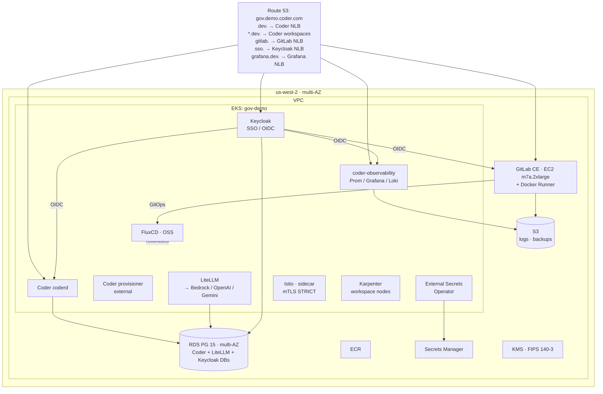

# Gov Demo Environment — Requirements Document

**Project:** gov.demo.coder.com
**Classification:** Unclassified — For Demo/Reference Use
**Version:** 0.5.0-DRAFT
**Date:** 2025-03-24

---

## 1. Purpose

This document defines the requirements for a single-region, multi-AZ
demonstration environment that mimics a sensitive government customer
deployment. The environment is GitOps-controlled, FIPS-enabled, and deploys a
lean developer-platform tool chain centered on Coder.

**Region:** us-west-2 (commercial). All config is parameterized for GovCloud
portability. A second region (us-east-1) with workspace proxy + external
provisioners can be added as a fast-follow — the architecture supports it
without refactoring.

This is a **one-SE-maintainable** environment. One EKS cluster, one EC2
instance, managed AWS services for everything else.

All requirements use **shall** (mandatory), **should** (recommended), or
**may** (optional) language per RFC 2119 to enable traceability.

---

## 2. Resolved Decisions

| # | Decision | Resolution |
|---|---|---|
| 1 | **Domain** | Base: `gov.demo.coder.com`. Subdomains: `dev.` (Coder), `grafana.dev.` (Grafana), `gitlab.` (GitLab), `flux.` (FluxCD UI if added), etc. |
| 2 | **DNS Delegation** | `demo.coder.com` is owned by Google Cloud DNS. A delegation NS record for `gov.demo.coder.com` shall point to an AWS Route 53 hosted zone. All records below that zone are managed in R53. |
| 3 | **Coder License** | Premium + AI Add-On, up to 50 users. External provisioners, workspace proxies, and AI Bridge are all available. |
| 4 | **Bedrock Models** | Claude Sonnet 4.6 (`us.anthropic.claude-sonnet-4-6`), Claude Opus 4.6 (`us.anthropic.claude-opus-4-6-v1`), Claude Haiku 4.5 (`us.anthropic.claude-haiku-4-5-20251001-v1:0`) |
| 5 | **External Providers** | LiteLLM shall also connect to OpenAI (GPT-4o, o4-mini) and Google Gemini (gemini-2.5-pro) via API key. |
| 6 | **NAT** | AWS NAT Gateway (zero-ops). fck-nat is not recommended. |
| 7 | **GitLab Runner** | Docker executor on the GitLab EC2 instance. |
| 8 | **LiteLLM DB** | Share Coder's RDS instance (separate database on same RDS). |
| 9 | **FluxCD** | OSS. |

---

## 3. Scope

### 3.1 What's In

| Component | Where | Why |
|---|---|---|
| **Coder** (coderd + provisioners) | EKS | The product being demoed |
| **Karpenter** | EKS | Workspace node scaling |
| **LiteLLM + AI Bridge** | EKS | AI coding demo hook — Bedrock, OpenAI, Gemini |
| **FluxCD** (OSS) | EKS | GitOps — low maintenance once bootstrapped |
| **Keycloak** | EKS | Central SSO (OIDC) for all services |
| **GitLab CE** (Omnibus + Docker Runner) | EC2 | Git source-of-truth, CI |
| **coder-observability** | EKS | Prometheus + Grafana + Loki in one chart |
| **External Secrets Operator** | EKS | AWS Secrets Manager → K8s Secrets |
| **Istio** (sidecar mode) | EKS | mTLS for all Coder east-west traffic |

### 3.2 What's Cut

| Cut | Replaced By | Rationale |
|---|---|---|
| Vault | AWS Secrets Manager + ESO | Zero ops |
| Harbor | Amazon ECR | Native, zero maintenance |
| Nexus OSS | Deferred | Add only if a demo calls for it |

### 3.3 GovCloud Portability

| Parameter | Default | GovCloud Override |
|---|---|---|
| `aws_region` | `us-west-2` | `us-gov-west-1` |
| `aws_partition` | `aws` | `aws-us-gov` |
| `use_fips_endpoints` | `true` | `true` |

No code changes — only `terraform.tfvars`.

### 3.4 Multi-Region Fast-Follow

When a demo requires two regions, add:
- `us-east-1` VPC + EKS cluster + Karpenter + FluxCD
- Coder workspace proxy (`workspaceProxy = true`)
- External provisioners tagged `region=us-east-1`
- VPC peering for provisioner → coderd connectivity
- `clusters/gov-demo-east/` path in the same Git repo

The single-region IaC is structured to make this additive, not a rewrite.

---

## 4. Trade Study: FluxCD vs ArgoCD

| Criterion | FluxCD | ArgoCD |
|---|---|---|
| Security posture | Pull-based, no UI attack surface | Web UI widens attack surface |
| Maintenance | Low — set and forget | Medium — UI, Redis, app-of-apps |
| Bootstrap | Terraform provider or CLI | kubectl + ArgoCD CLI |

**Decision: FluxCD OSS** — minimal attack surface, minimal maintenance.

---

## 5. Architecture



**What you keep alive:** 1 EKS cluster (6 Helm charts) + 1 EC2 (GitLab) + managed AWS services.

---

## 6. Requirements

### 6.1 Infrastructure

| ID | Requirement | Priority |
|---|---|---|
| INFRA-001 | The environment **shall** deploy to us-west-2 (commercial). | Must |
| INFRA-002 | All region/partition/endpoint config **shall** be parameterized for GovCloud portability. | Must |
| INFRA-003 | All AWS API calls **shall** use FIPS-validated endpoints. | Must |
| INFRA-004 | All data at rest **shall** be encrypted via KMS (SSE-KMS). | Must |
| INFRA-005 | All data in transit **shall** use TLS 1.2+. | Must |
| INFRA-006 | Infrastructure **shall** be Terraform, stored in gov.demo.coder.com. | Must |
| INFRA-007 | The VPC **shall** use private subnets + AWS NAT Gateway for outbound. | Must |
| INFRA-008 | The VPC **shall** span ≥2 AZs. | Must |
| INFRA-009 | Security groups **shall** follow least-privilege. | Must |
| INFRA-010 | Route 53 **shall** host the `gov.demo.coder.com` zone. Google Cloud DNS for `demo.coder.com` **shall** delegate via NS records. ACM **shall** provision TLS certs. | Must |
| INFRA-011 | Elastic IPs **should** be allocated for stable ingress. | Should |
| INFRA-012 | Terraform state **shall** be in S3 + DynamoDB, KMS-encrypted. | Must |
| INFRA-013 | Amazon SES **shall** be configured in us-west-2 for transactional email (password resets, notifications). | Must |
| INFRA-014 | The `gov.demo.coder.com` domain **shall** be verified in SES with SPF, DKIM, and DMARC DNS records in Route 53. All services **shall** send from `noreply@gov.demo.coder.com`. | Must |

### 6.2 EKS Cluster

| ID | Requirement | Priority |
|---|---|---|
| EKS-001 | One EKS cluster (`gov-demo`) **shall** be provisioned in us-west-2. | Must |
| EKS-002 | Kubernetes **shall** be 1.30+. | Must |
| EKS-003 | Managed node group **shall** use Bottlerocket FIPS AMIs. | Must |
| EKS-004 | Add-ons: CoreDNS, kube-proxy, vpc-cni, EBS CSI driver. | Must |
| EKS-005 | API server **shall** be private-only or dual with restricted public CIDRs. | Must |
| EKS-006 | All workload IAM **shall** use IRSA. No static keys. | Must |
| EKS-007 | Audit logging **shall** be enabled → CloudWatch. | Must |
| EKS-008 | A "system" managed node group **shall** run platform workloads. | Must |
| EKS-009 | Default StorageClass: EBS CSI gp3, encrypted, `WaitForFirstConsumer`. | Must |

### 6.3 Karpenter

| ID | Requirement | Priority |
|---|---|---|
| KARP-001 | Karpenter **shall** be deployed via Helm, 2 replicas across AZs. | Must |
| KARP-002 | Controllers **shall** be pinned to the system node group. | Must |
| KARP-003 | ≥1 EC2NodeClass for workspace nodes (≥200 GiB gp3 root). | Must |
| KARP-004 | NodePools **shall** support spot + on-demand. | Must |
| KARP-005 | Spot termination handling (SQS + EventBridge) **shall** be enabled. | Must |
| KARP-006 | Consolidation **should** be `WhenEmpty` with configurable TTL. | Should |
| KARP-007 | Image-prefetch DaemonSet **should** warm base images. | Should |
| KARP-008 | Subnet/SG discovery via `karpenter.sh/discovery` tags. | Must |

### 6.4 FluxCD

| ID | Requirement | Priority |
|---|---|---|
| FLUX-001 | FluxCD OSS **shall** be the sole GitOps engine. | Must |
| FLUX-002 | FluxCD **shall** be bootstrapped via Terraform provider targeting GitLab CE. | Must |
| FLUX-003 | Source-of-truth: gov.demo.coder.com on GitLab CE, path `clusters/gov-demo/`. | Must |
| FLUX-004 | Controllers: source, kustomize, helm, notification. | Must |
| FLUX-005 | Reconciliation interval ≤5 min. | Must |
| FLUX-006 | `dependsOn` **shall** enforce infra-before-apps. | Must |
| FLUX-007 | Git auth via SSH keys. | Must |

### 6.5 Coder

| ID | Requirement | Priority |
|---|---|---|
| CDR-001 | Coderd **shall** run on EKS via the official Helm chart. **The deployment shall use the latest RC release** to enable Coder Agents (`CODER_EXPERIMENTS=agents`). See [Coder Agents Early Access](https://coder.com/docs/ai-coder/agents/early-access). | Must |
| CDR-002 | Coderd **shall** be exposed via ALB + ACM TLS at `dev.gov.demo.coder.com`. with AWS WAF Web ACL attached. | Must |
| CDR-003 | Database: RDS PostgreSQL 15+, multi-AZ, automated backups, 7-day retention. LiteLLM shares the same RDS instance (separate database). | Must |
| CDR-004 | Auth via Keycloak OIDC (`sso.gov.demo.coder.com`). | Must |
| CDR-005 | Workspaces **shall** schedule on Karpenter NodePools. | Must |
| CDR-006 | AI Bridge **shall** be enabled. | Must |
| CDR-007 | The `coder-observability` chart **shall** be deployed. | Must |
| CDR-008 | Resource requests ≥1000m CPU / 2Gi memory. | Must |
| CDR-009 | Pod topology spread **should** distribute across AZs. | Should |
| CDR-010 | Templates **shall** be stored in GitLab CE, managed via Terraform. | Must |
| CDR-011 | Templates **should** support both K8s and EC2 workspace types. | Should |
| CDR-012 | Coder binaries and container images **shall** be built from source with FIPS 140-3 mode enabled (`GOFIPS140=latest`). See `docs/CODER_FIPS_BUILD.md`. | Must |
| CDR-013 | Path-based workspace apps **shall** be disabled. Only wildcard subdomain routing (`*.dev.gov.demo.coder.com`) **shall** be used. | Must |
| CDR-014 | HSTS **shall** be enabled on the Coder ALB/Ingress. | Must |
| CDR-015 | Connection Logs (Premium) **shall** be enabled for all workspace agent connections. | Must |
| CDR-016 | Agent Boundaries **shall** be enabled on AI templates to restrict/audit agent network access. | Must |
| CDR-017 | Audit log retention **shall** be ≥2 years (`CODER_AUDIT_LOGS_RETENTION`). | Must |
| CDR-018 | A dedicated CI/CD service account **shall** push templates from GitLab (no human credentials). | Must |

### 6.6 Coder Provisioners

| ID | Requirement | Priority |
|---|---|---|
| PROV-001 | External provisioners **shall** run via the `coder-provisioner` Helm chart. | Must |
| PROV-002 | Provisioners **shall** use IRSA (EC2ReadOnly + scoped provisioner policy). | Must |
| PROV-003 | Provisioner key **shall** be stored in Secrets Manager, synced via ESO. | Must |
| PROV-004 | Provisioners **should** run ≥2 replicas. | Should |
| PROV-005 | Coderd **shall** set `provisionerDaemons = 0` (external provisioners only, Premium license). | Must |

### 6.7 AI Bridge + LiteLLM

| ID | Requirement | Priority |
|---|---|---|
| AI-001 | AI Bridge **shall** be enabled on coderd. | Must |
| AI-002 | LiteLLM **shall** run on EKS via Helm as the upstream gateway for AI Bridge. | Must |
| AI-003 | LiteLLM **shall** integrate with AWS Bedrock via IRSA for Claude models: Sonnet 4.6 (`us.anthropic.claude-sonnet-4-6`), Opus 4.6 (`us.anthropic.claude-opus-4-6-v1`), Haiku 4.5 (`us.anthropic.claude-haiku-4-5-20251001-v1:0`). | Must |
| AI-004 | LiteLLM **shall** autoscale (min 1, max 5, 80% CPU). | Must |
| AI-005 | PostgreSQL for API key / usage tracking (shared RDS, separate DB). | Must |
| AI-006 | AI Bridge **shall** support Anthropic + OpenAI-compatible endpoints. | Must |
| AI-007 | AI Bridge **shall** record token usage and request metadata. | Must |
| AI-008 | Model config via FluxCD-managed ConfigMap. | Must |
| AI-009 | LiteLLM **shall** connect to OpenAI (GPT-4o, o4-mini) via API key stored in Secrets Manager. | Must |
| AI-010 | LiteLLM **shall** connect to Google Gemini (gemini-2.5-pro) via API key stored in Secrets Manager. | Must |

### 6.8 GitLab CE + Runner

| ID | Requirement | Priority |
|---|---|---|
| GL-001 | GitLab CE **shall** be deployed on EC2 (`m7a.2xlarge` — 8 vCPU / 32 GiB, AMD) via Omnibus. | Must |
| GL-002 | EC2 **shall** run AL2023 or RHEL 9 with FIPS kernel. | Must |
| GL-003 | Bundled PostgreSQL and Redis (single-instance demo). | Must |
| GL-004 | S3 for object storage (LFS, artifacts, backups). | Must |
| GL-005 | ALB + ACM TLS at `gitlab.gov.demo.coder.com` with AWS WAF Web ACL. | Must |
| GL-006 | Git source-of-truth for FluxCD + Coder templates. | Must |
| GL-007 | GitLab **shall** authenticate users via Keycloak OIDC (replacing local username/password). | Must |
| GL-008 | Daily backups to S3, 30-day retention. | Must |
| GL-009 | A GitLab Runner **shall** be registered on the same EC2 instance. | Must |
| GL-010 | Runner **shall** use a Docker executor on the same EC2 host for CI jobs. | Must |
| GL-011 | Runner **should** be able to build + push images to ECR. | Should |
| GL-012 | K8s-based runner on EKS **may** be added later. | May |
| GL-013 | Host OS **should** be STIG-hardened (best-effort). | Should |
| GL-014 | ASG (min 1, max 1) **should** provide self-healing. | Should |
| GL-015 | GitLab **shall** use Amazon SES as its SMTP relay for notification emails (`noreply@gov.demo.coder.com`). | Must |
| GL-016 | GitLab SSH **shall** be disabled. All Git operations **shall** use HTTPS only. | Must |

### 6.9 Secrets Management

| ID | Requirement | Priority |
|---|---|---|
| SM-001 | AWS Secrets Manager **shall** store all sensitive values (DB passwords, API keys, OAuth secrets, provisioner keys). | Must |
| SM-002 | External Secrets Operator **shall** sync secrets into K8s. | Must |
| SM-003 | No secrets in plain text in Git. | Must |
| SM-004 | Secrets Manager **shall** use KMS encryption. | Must |

### 6.10 Container Registry

| ID | Requirement | Priority |
|---|---|---|
| REG-001 | ECR **shall** be the container registry. | Must |
| REG-002 | Image scanning **shall** be enabled. | Must |
| REG-003 | Lifecycle policies **should** retain last 30 tagged images. | Should |
| REG-004 | A custom FIPS workspace base image **shall** be built via GitLab CI and pushed to ECR. | Must |

### 6.11 Observability

| ID | Requirement | Priority |
|---|---|---|
| OBS-001 | `coder-observability` chart **shall** be deployed. | Must |
| OBS-002 | Loki **shall** use S3 for log storage. | Must |
| OBS-003 | Grafana Agent **shall** run as DaemonSet on all nodes. | Must |
| OBS-004 | Grafana **should** be exposed via NLB + TLS at `grafana.dev.gov.demo.coder.com`. | Should |
| OBS-005 | Grafana **should** authenticate users via Keycloak OIDC. | Should |

### 6.12 Keycloak (SSO / Identity Provider)

| ID | Requirement | Priority |
|---|---|---|
| KC-001 | Keycloak **shall** be deployed on EKS via the Bitnami Helm chart, managed by FluxCD. | Must |
| KC-002 | Keycloak **shall** use the shared RDS instance (separate database). | Must |
| KC-003 | Keycloak **shall** be exposed via ALB + ACM TLS at `sso.gov.demo.coder.com` with WAF. `/admin` path **shall** be IP-restricted via WAF rule. | Must |
| KC-004 | A single realm (`gov-demo`) **shall** be configured with OIDC clients for: Coder, GitLab, Grafana. | Must |
| KC-005 | Users **shall** be managed locally in Keycloak (no LDAP/AD for demo). | Must |
| KC-006 | Self-service registration **shall** be disabled. User provisioning is admin-only via Keycloak admin console. | Must |
| KC-007 | Keycloak **should** enforce MFA (TOTP) for all users. | Should |
| KC-008 | Keycloak **should** be configured with an X.509 client cert auth flow (PIV/CAC simulation) for demo purposes. | Should |
| KC-009 | The `keycloak` namespace **shall** be labeled `istio-injection=enabled` for mTLS. | Must |
| KC-010 | Coder **shall** auto-create users on first OIDC login from Keycloak. | Must |
| KC-011 | GitLab **shall** auto-create users on first OIDC login (`allow_single_sign_on`). | Must |
| KC-012 | Grafana **shall** auto-create users on first OIDC login (`auto_login = true`). | Should |
| KC-013 | Keycloak **shall** use Amazon SES as its SMTP provider for password reset and verification emails (`noreply@gov.demo.coder.com`). | Must |
| KC-014 | Keycloak **shall** enable brute force detection (lock after 5 failed attempts, 5-min lockout). | Must |
| KC-015 | Keycloak **shall** enable WebAuthn/Passkeys (Authentication → Policies → WebAuthn Passwordless Policy) for TouchID/FIDO2 MFA. | Must |
| KC-016 | Passkey registration **shall** be a required action for new users. | Must |

### 6.13 Istio (Service Mesh / mTLS)

| ID | Requirement | Priority |
|---|---|---|
| MESH-001 | Istio **shall** be deployed via Helm (istio/base + istio/istiod), managed by FluxCD. | Must |
| MESH-002 | Istio **shall** use sidecar mode (not ambient) for maturity and EKS compatibility. | Must |
| MESH-003 | The `coder`, `coder-provisioner`, `litellm`, and `keycloak` namespaces **shall** be labeled `istio-injection=enabled`. | Must |
| MESH-004 | A `PeerAuthentication` with `mode: STRICT` **shall** be applied to all mesh-enrolled namespaces. | Must |
| MESH-005 | `istio-system`, `kube-system`, `flux-system`, and `karpenter` namespaces **shall NOT** be in the mesh. | Must |
| MESH-006 | Istio Ingress Gateway **may** replace NLB for north-south if beneficial; otherwise NLB direct with mesh east-west only. | May |
| MESH-007 | Istio **shall** be scoped to mTLS only — no VirtualService routing or traffic splitting initially. | Must |
| MESH-008 | Kiali **may** be deployed for mesh visualization. | May |

### 6.14 Security & Compliance

| ID | Requirement | Priority |
|---|---|---|
| SEC-001 | All crypto **shall** use FIPS 140-2/140-3 validated modules. | Must |
| SEC-002 | KMS **shall** manage all encryption keys. | Must |
| SEC-003 | All inter-service traffic **shall** use TLS 1.2+. | Must |
| SEC-004 | No static IAM keys in-cluster; IRSA only. | Must |
| SEC-005 | CloudTrail **shall** be enabled. | Must |
| SEC-006 | Images **should** come from ECR or verified upstream. | Should |
| SEC-007 | NetworkPolicies **should** restrict pod-to-pod traffic. | Should |
| SEC-008 | EC2 host OS **should** be STIG-hardened (best-effort). | Should |
| SEC-009 | EKS nodes **should** use Bottlerocket FIPS AMIs. | Should |
| SEC-010 | AWS Shield Standard **shall** be relied upon for DDoS protection (automatic, no extra config). | Must |
| SEC-011 | VPC Flow Logs **shall** be enabled and shipped to CloudWatch Logs. | Must |
| SEC-012 | AWS WAF **shall** be deployed with AWS Managed Rules (Core Rule Set, Known Bad Inputs, Bot Control) on all public-facing ALBs. | Must |
| SEC-013 | The AWS Load Balancer Controller **shall** be deployed to provision ALBs from Kubernetes Ingress resources with WAF annotation support. | Must |

### 6.15 Logging & SIEM

| ID | Requirement | Priority |
|---|---|---|
| LOG-001 | CloudTrail logs **shall** be shipped to CloudWatch Logs. | Must |
| LOG-002 | VPC Flow Logs **shall** be shipped to CloudWatch Logs. | Must |
| LOG-003 | Coder audit logs **shall** be shipped to CloudWatch Logs (via Grafana Agent). | Must |
| LOG-004 | AI Bridge token usage **shall** be queryable via LiteLLM PostgreSQL + Grafana dashboards. | Must |
| LOG-005 | Keycloak auth events **shall** be shipped to CloudWatch Logs. | Must |
| LOG-006 | Amazon OpenSearch Serverless **shall** be deployed as SIEM, ingesting CloudWatch Logs. | Must |
| LOG-007 | OpenSearch dashboards **should** include: failed logins, API anomalies, network flows, AI usage. | Should |

### 6.16 Bootstrap & Repo Structure

| ID | Requirement | Priority |
|---|---|---|
| BOOT-001 | EKS **shall** be provisioned via Terraform before FluxCD bootstrap. | Must |
| BOOT-002 | FluxCD bootstrap **shall** be a Terraform resource. | Must |
| BOOT-003 | Repo structure: | Must |

```
gov.demo.coder.com/
├── docs/
│   └── REQUIREMENTS.md
├── infra/
│   └── terraform/
│       ├── 0-state/              # S3 backend + DynamoDB
│       ├── 1-network/            # VPC, subnets, NAT GW, Route 53
│       ├── 2-data/               # RDS (Coder DB + LiteLLM DB), S3, KMS, Secrets Mgr, ECR
│       ├── 3-eks/                # EKS cluster, node groups, IRSA
│       ├── 4-bootstrap/          # FluxCD + Karpenter
│       └── 5-gitlab/             # GitLab CE EC2 + Docker Runner
├── clusters/
│   └── gov-demo/
│       ├── flux-system/
│       ├── infrastructure/
│       │   ├── sources/
│       │   ├── istio/
│       │   ├── karpenter/
│       │   ├── external-secrets/
│       │   └── kustomization.yaml
│       └── apps/
│           ├── coder-server/
│           ├── coder-provisioner/
│           ├── litellm/
│           ├── monitoring/
│           └── kustomization.yaml
└── templates/
    ├── kubernetes-claude/
    ├── aws-linux/
    └── aws-devcontainer/
```

| ID | Requirement | Priority |
|---|---|---|
| BOOT-004 | `dependsOn` **shall** enforce infra-before-apps. | Must |
| BOOT-005 | Sequence: 0-state → 1-network → 2-data → 3-eks → 4-bootstrap (Flux + Karpenter + Istio) → 5-gitlab → Flux reconciles apps. | Must |
| BOOT-006 | All Helm chart versions **shall** be pinned. | Must |
| BOOT-007 | Istio **shall** deploy as infrastructure (before apps) so sidecars inject on first app pod creation. | Must |

---

## 7. Traceability

| Req ID | Category | Traces To |
|---|---|---|
| INFRA-001 – 014 | AWS Infrastructure | NIST SP 800-53, FIPS 140-3 |
| EKS-001 – 009 | EKS Cluster | CIS EKS Benchmark, ai.coder.com |
| KARP-001 – 008 | Karpenter | ai.coder.com reference |
| FLUX-001 – 007 | FluxCD | Trade Study §4 |
| CDR-001 – 018 | Coder | ai.coder.com, Coder docs |
| PROV-001 – 005 | Provisioners | ai.coder.com coder-provisioner module |
| AI-001 – AI-010 | AI Bridge / LiteLLM | ai.coder.com, Coder AI Bridge docs |
| GL-001 – 015 | GitLab CE + Runner | GitLab AWS reference arch |
| SM-001 – 004 | Secrets | AWS Secrets Manager docs |
| REG-001 – 003 | Registry | ECR docs |
| OBS-001 – 004 | Observability | ai.coder.com |
| KC-001 – 016 | Keycloak / SSO | Keycloak docs, OIDC best practices |
| MESH-001 – 008 | Istio / mTLS | Istio docs, EKS best practices |
| SEC-001 – 013 | Security | FIPS 140-2/3, DISA STIG |
| LOG-001 – 007 | Logging / SIEM | CloudWatch, OpenSearch Serverless |
| BOOT-001 – 008 | Bootstrap | FluxCD docs |

---

## 8. Resolved Items (formerly open)

| # | Item | Resolution |
|---|---|---|
| 1 | DNS delegation | SE owns this. Script at `docs/dns-delegation.sh`. Run after `1-network` terraform apply. |
| 2 | Bedrock model access | SE enables in console. Instructions at `docs/BEDROCK_SETUP.md`. |
| 3 | OpenAI + Gemini API keys | SE has keys. Store in AWS Secrets Manager during `2-data` terraform apply. |
| 4 | GitLab EC2 instance size | `m7a.2xlarge` (8 vCPU / 32 GiB, AMD EPYC). GitLab Omnibus ~8 GB + Docker runner builds get the rest. Runner executes on the same host. ~$0.46/hr on-demand, ~$338/mo. |
| 5 | Workspace base image | Custom FIPS images built via GitLab CI → ECR. RHEL 9 UBI with `crypto-policies FIPS` + validated OpenSSL. Two images: `coder-enterprise-fips` (base) and `coder-desktop-fips` (XFCE + KasmVNC). See `images/` directory. |
| 6 | LiteLLM spend caps | No spend caps. |
| 7 | Day-1 templates | `dev-codex` (generic dev + Codex CLI + code-server + mux) and `agents-dev` (Coder Agents — server-side AI, no client-side LLM config). See `templates/` directory. |
| 8 | Coder version | **Latest RC release** required for Coder Agents feature (`CODER_EXPERIMENTS=agents`). |
| 9 | Coder FIPS build | Build Coder from source with `GOFIPS140=latest` (Go 1.24+ native FIPS 140-3). No cgo/BoringSSL needed. See `docs/CODER_FIPS_BUILD.md`. |
| 10 | Istio | Sidecar mode, mTLS STRICT on Coder/LiteLLM namespaces only. East-west encryption. No traffic management features initially. |
| 11 | Keycloak | Central SSO, admin-only user provisioning. OIDC for Coder, GitLab, Grafana. All three auto-create users on first login. No self-registration. Shares RDS. `sso.gov.demo.coder.com`. |
| 12 | Email | Amazon SES, single sender: `noreply@gov.demo.coder.com` for all services (Keycloak, GitLab, Coder if enabled later). Domain verified with SPF/DKIM/DMARC. |
| 13 | WAF | ALB + AWS WAF (Managed Rules). ALB supports wildcard subdomain routing for Coder (`*.dev.gov.demo.coder.com`). Keycloak `/admin` IP-restricted. No CloudFront. |
| 14 | Passkeys | Keycloak WebAuthn Passwordless Policy enabled. TouchID/FIDO2/YubiKey supported. Required action for new users. |
| 15 | GitLab SSH | Disabled. HTTPS-only for all Git operations. |
| 16 | SIEM | CloudWatch Logs → OpenSearch Serverless. Ingests CloudTrail, VPC Flow Logs, Coder audit, Keycloak auth events. |
| 17 | Shield | Standard only (automatic). No Shield Advanced. |
| 18 | Coder security | Path-based apps disabled (XSS risk), wildcard subdomain only. HSTS, Connection Logs, Agent Boundaries enabled. Audit logs 2yr. Dedicated CI/CD service account. |

---

## 9. Open Items

| # | Item | Status |
|---|---|---|
| — | All major items resolved. | — |
